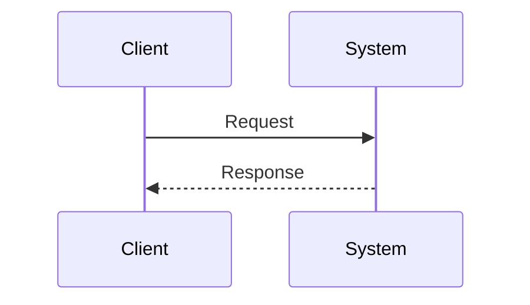

# SPEC-NNNN: <Short Feature Title>

- **Status**: Draft | In Review | Approved | Implemented | Rejected | Superseded by SPEC-XXXX
- **Owner**: <name / team>
- **Created**: YYYY-MM-DD
- **Last updated**: YYYY-MM-DD
- **Target device(s)**: desktop (1440px) | tablet (768px) | mobile (375px) - list all supported viewports
- **Related ADRs**: <links if any>
- **Related issues / PRs**: <links>
- **Source pitch**: <docs/pitches/YYYY-MM-DD-pitch-NNNN-slug.md or n/a>
- **Pitch impact**: <IMP-NNN or n/a>

---

## 1. Summary

> One paragraph. What is this feature? Who is it for? Why now?

## 2. Motivation

> Why does this need to exist? What problem does it solve? What evidence drove this?

## 3. Goals

- Goal 1
- Goal 2

## 4. Non-Goals

> What is explicitly out of scope?

- Non-goal 1
- Non-goal 2

## 5. User Stories

> Frame from the user's perspective.

- As a **<role>**, I want to **<action>**, so that **<outcome>**.
- As a **<role>**, I want to **<action>**, so that **<outcome>**.

## 6. Requirements

### Functional

> Filled by Drake during pm-brief. Tag each requirement with its scope: `*(S1)*`, `*(S2)*`, etc.

- [ ] FR-1 *(S1)*: ...
- [ ] FR-2 *(S1)*: ...

### Non-Functional

#### Accessibility (UX)

> Filled by Ellie during ux-brief.

- [ ] NFR-A1: ...

#### Performance & Security (Architecture)

> Filled by Kratos during arch-review.

- [ ] NFR-K1: ...

## 7. Scopes & Acceptance Criteria

> Each scope represents one independently deliverable feature. Drake defines scope shells and functional AC during pm-brief. Ellie appends UX and accessibility AC in the same scope.

### Scope 1: <Deliverable Feature Name>

**Covers:** FR-1, FR-2

- [ ] Given **<context>**, when **<action>**, then **<observable outcome>**.

### Scope 2: <Deliverable Feature Name>

**Covers:** FR-N

- [ ] Given **<context>**, when **<action>**, then **<observable outcome>**.

## 8. Design

### Tech Stack

> Filled by Drake during pm-brief. Kratos validates and expands during arch-review.

| Layer | Technology | Notes |
|-------|------------|-------|
| Framework | <e.g., PySide6, Next.js, Remix, Angular> | <version, rendering model, or relevant constraints> |
| Component library | <e.g., Qt Widgets, shadcn/ui, MUI, custom> | <version, customization approach, or "custom" if none> |
| Language | <e.g., Python, TypeScript> | <version or relevant compiler/runtime notes> |
| Styling | <e.g., Qt stylesheets, Tailwind CSS, CSS Modules> | <relevant configuration or constraints> |
| Key dependencies | <dependencies that affect UX or architecture decisions> | <notes> |

### Approach

> User flow narrative filled by Ellie during ux-brief.

### API / Interface

> Contract shape filled by Kratos during arch-review.

```text
# Example: HTTP endpoint, function signature, CLI command, or Qt signal/slot contract.
```

### Data Model

> New or changed entities, migrations, and backfill plan filled by Kratos during arch-review.

```text
Entity { field, field, ... }
```

### Diagram

> UX flow diagram written by Ellie during ux-brief. Kratos may append a system-level diagram during arch-review.



## 9. Alternatives Considered

- **Option A** - pros / cons / why not chosen.
- **Option B** - pros / cons / why not chosen.

## 10. Edge Cases & Failure Modes

- What if input is empty, malformed, or oversized?
- What happens on partial failure?
- Concurrency or race conditions?
- Rate limiting or abuse?

## 11. Rollout Plan

- [ ] Feature flag? Name: `...`
- [ ] Migration steps
- [ ] Backward compatibility considerations
- [ ] Rollback plan

## 12. Observability

- **Logs**: what to log, at what level
- **Metrics**: what counters/timers to emit
- **Alerts**: what thresholds trigger paging

## 13. Decision & Open Question Register

> Canonical owner for all open questions, resolved decisions, accepted assumptions, and follow-ups discovered during the spec workshop.

| ID | Status | Type | Source | Question / Decision | Recommendation | Answer / Assumption | Owner / Milestone | Impacted artifacts |
|----|--------|------|--------|---------------------|----------------|---------------------|-------------------|--------------------|
| Q-001 | Blocking | PM / UX / Architecture / Delivery / Cross-functional | <phase or agent> | <one focused question or decision> | <recommended option and why> | <TBD, answer, or accepted assumption> | <owner and milestone, or n/a> | <spec.md section IDs, ux.md, mockups.md, prototype, implementation> |

## 14. Implementation Notes

> Filled during implementation. Capture deviations, gotchas, and follow-ups.

- _(empty until implementation begins)_

## 15. Spec Revision Log

> Tracks how this living spec evolves from pitch-driven changes.

| Revision | Source pitch | Pitch impact | Summary of change | Impacted scopes | Status |
|----------|--------------|--------------|-------------------|-----------------|--------|
| R1 | <source pitch or n/a> | <IMP-NNN or n/a> | Initial spec workshop | <S1, S2, ...> | Draft |

## 16. References

- Related specs / ADRs
- External docs, RFCs, papers
- Prior art

---

## Spec Workshop Log

> Updated automatically by the spec-workshop skill at the end of each phase.

| Phase | Agent | Model | Completed |
|-------|-------|-------|-----------|
