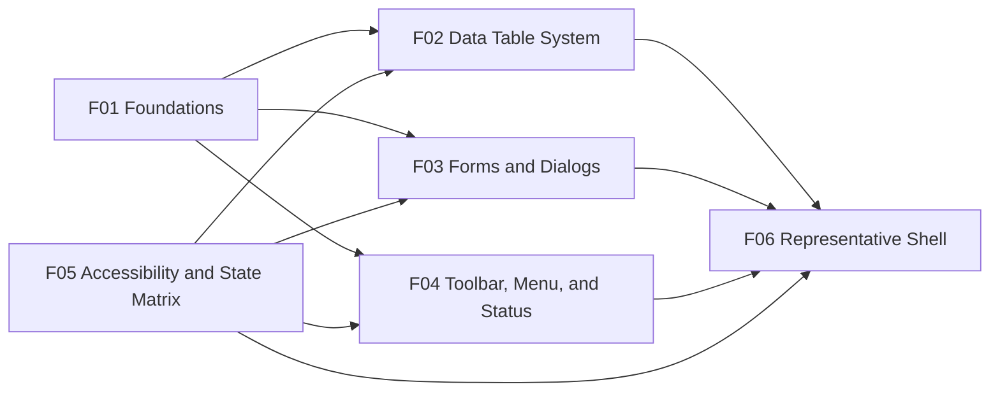

# Mockup Specification - UI Design System

## 1. Document Control

| Field | Value |
|---|---|
| Spec ID | spec-0001 |
| Feature | ui-design-system |
| Phase | UX Mockups |
| Artifact type | Tool-agnostic design-system board / pattern mockup specification |
| Source pitch | docs/pitches/2026-05-16-pitch-0001-design-refactor.md |
| Pitch impact | IMP-001 |
| Target platform | Windows desktop with Tekla integration |
| Baseline viewport | 1440px wide desktop |
| Minimum viewport | 1366px wide desktop |
| UI technology context | PySide6 / Qt Widgets |
| Prototype files created | None |
| Planned next phase | ux-prototype |
| Durable artifact | docs/specs/spec-0001/mockups.md |

### 1.1 Objective

Define a recreateable visual and interaction specification for the Tekla Nest lightweight PySide6 design system. This artifact describes the planned design-system mockup board, representative frames, component states, accessibility requirements, and visual direction without redesigning full product workflows.

### 1.2 Scope Boundary

This mockup spec covers design-system and pattern examples only:

- Foundation tokens and visual principles.
- Table system patterns.
- Forms and dialogs.
- Toolbar, menu, navigation, and status messaging patterns.
- Accessibility and state examples.
- One representative current-shell composition based on the existing three-panel application model.

This mockup spec does not cover:

- Full workflow redesign.
- Optimization logic.
- Service interfaces.
- Production PySide6 implementation.
- Prototype file creation in this phase.
- Final Tekla Structures palette adoption before exact evidence is captured.

### 1.3 Evidence Base

Observed current UI evidence:

- `NestWindow` uses `QMainWindow`, initial size `1500x800`, central widget with zero margins, and horizontal splitter sizes `[400, 370, 650]`.
- Current shell areas are Parts Table, Stock Tabs, and Report Preview.
- Menus: File, Stock, Nesting, View.
- Toolbar: fixed 48px height, optional logo scaled to 36px high, 8px horizontal logo margins, 16px bold title.
- Tables use `QTableView` / `QAbstractTableModel`, editable rows, stretched headers, and columns for quantity, length, reference, profile, and material.
- Report preview uses `QTextBrowser`, including internal `reorder://...` links.
- Activation dialog and color schema dialog provide current modal examples.
- Current theme values:
  - Primary: `#1a73e8`
  - Accent: `#ff6d00`
  - Background: `#f5f5f5`
  - Surface/input: `#ffffff`
  - Foreground: `#333333`
  - Border: `#cccccc`
  - Alternate row: `#f0f0f0`

Accepted phase assumption:

- Current app colors and public Tekla presentation references may be used to unblock UX Mockups.
- Exact Tekla screenshots and palette samples remain Section 13 follow-up Q-025 before production visual adoption.

## 2. Design System Application

### 2.1 Visual Direction

Selected direction: **modern SaaS/data-product desktop UI with restrained engineering professionalism.**

The mockups should look:

- Structured and precise.
- Calm and work-focused.
- Dense enough for engineering table work, but not visually crowded.
- Consistent across menus, tables, dialogs, forms, report-adjacent UI, and status messaging.
- Accessible without relying on color alone.

The direction should avoid:

- Consumer-app styling with oversized cards, excessive whitespace, or playful illustration.
- Dark-mode-first assumptions.
- Direct copying of Tekla Structures visual assets or proprietary presentation details.
- Workflow-specific redesign beyond representative shell composition.

UX Review visual research note:

- Awwwards' public category guidance supports a restrained interpretation: colorful palettes should use a limited 3-5 color set with careful background choice; clean design should prioritize precise placement and elegance; minimal design should rely on balance, alignment, and contrast; typography should be consistent; and data visualization should make complex information easier to understand.
- Gradients and vibrant accents may be used as secondary treatments for hover, focus, icons, or selected details, not as primary table or dialog surfaces.
- This refinement selects Plan B, the modern application UI-kit benchmark, for UX artifact exploration while keeping Q-025's Tekla screenshot/palette evidence as a production-adoption follow-up.

### 2.1.1 Visual Direction Plan A - Tekla Schema Dependent

Purpose:

- Validate whether Tekla Nest should derive its production visual schema from exact Tekla product evidence.
- Use this track only after the team provides exact Tekla screenshots and palette samples.
- Keep the current prototype palette as exploratory until this evidence is reviewed.

Screenshot intake:

- Preferred repository path: `docs/specs/spec-0001/references/tekla-screenshots/`.
- Acceptable workshop alternative: attach screenshots directly in the chat session and record the resulting evidence summary in this spec.
- Recommended file naming: `tekla-structures-<surface>-<state>-<YYYYMMDD>.<ext>`, for example `tekla-structures-toolbar-default-20260516.png`.
- Each screenshot should include source context, product/version if known, screen/state, and whether the palette is approved for Tekla Nest influence or only reference analysis.

Activities:

1. Capture representative Tekla surfaces: shell/chrome, menus/toolbars, table-heavy views, dialogs/forms, status/warning/error states, and report-adjacent review surfaces.
2. Extract palette candidates into semantic roles rather than direct brand copies: background, surface, primary action, accent, focus, success, warning, danger, info, disabled, border, and selection.
3. Compare extracted colors and spacing against current Tekla Nest anchors from Section 1.3.
4. Validate accessibility implications: contrast, focus appearance, high contrast compatibility, state meaning not conveyed by color alone, and high-DPI legibility.
5. Produce a selected Tekla-dependent schema or reject Tekla-dependent palette adoption with rationale.

Decision gate:

- Do not adopt the Tekla-dependent schema for production until Section 13 Q-025 is updated with evidence, selected tokens, accessibility checks, and owner approval.

### 2.1.2 Visual Direction Plan B - Modern Application UI Kit Benchmark

Purpose:

- Evaluate a state-of-the-art modern application UI direction without depending on exact Tekla palette evidence.
- Use contemporary desktop/product UI-kit principles as benchmarks, not as automatic dependency or component-library adoption.
- Preserve PySide6/Qt Widgets feasibility and the current app's dense engineering workflow needs.
- Selected for UX Review refinement because it better satisfies the user's feedback that the previous color schema did not feel right.

Candidate benchmark sources:

- Microsoft Fluent-style Windows desktop principles for native-feeling command bars, focus, density, and status feedback.
- Material Design-style state, elevation, typography, and interaction clarity where appropriate for cross-platform mental models.
- Enterprise/data-product patterns from modern table-heavy applications for filtering, sorting, selection, batch actions, empty states, error recovery, and status messaging.

Activities:

1. Define a neutral modern desktop token set using the same semantic roles as Plan A.
2. Benchmark command grouping, table density, form/dialog behavior, focus treatment, and state feedback against modern UI-kit conventions.
3. Map each benchmark pattern back to PySide6/Qt Widgets implementation feasibility before adoption.
4. Compare the result against the Tekla-dependent schema using usability, accessibility, implementation cost, visual fit, and planner trust.
5. Select either the modern UI-kit benchmark direction, the Tekla-dependent direction, or a controlled hybrid with documented rationale.

Decision gate:

- External UI-kit patterns remain candidates under Section 13 Q-022. Any production adoption requires a Section 13 decision recording rationale, accessibility impact, and implementation constraints.

### 2.2 Foundation Token Candidates

Since no `DESIGN.md` exists, the following are proposed design-system token categories and starter values for mockup use.

#### Color roles

| Token role | Mockup value / rule | Usage |
|---|---:|---|
| `color.bg.app` | `#f6f8fb` | Main app background |
| `color.bg.surface` | `#ffffff` | Panels, dialogs, table surfaces, inputs |
| `color.bg.subtle` | `#eef2f7` | Alternate table rows, quiet grouped regions |
| `color.text.primary` | `#172033` | Primary labels, body text, table content |
| `color.text.muted` | `#5b677a` | Helper text, metadata, subdued copy |
| `color.border.default` | `#8a94a6` | Inputs, table grid, separators; chosen to improve non-text contrast over the old `#cccccc` anchor |
| `color.action.primary` | `#1d4ed8` | Primary buttons, selected tabs, active table header emphasis |
| `color.action.primary.dark` | `#173b6c` | Link text, pressed state, deep command emphasis |
| `color.action.accent` | `#0f766e` | Secondary emphasis, selected detail, hover highlight, focus-adjacent accent |
| `color.action.accent.subtle` | `#e6fffb` | Subtle hover or accent-adjacent surfaces without overusing saturated color |
| `color.action.cyan` | `#0891b2` | Optional modern SaaS accent for icons, progress glyphs, or data highlights |
| `color.editable.focus.bg` | `#ecfeff` | Editable table-cell focus background paired with border and focus ring |
| `color.state.success` | `#15803d` | Success confirmations |
| `color.state.warning` | `#b45309` | Recoverable warnings and partial-result states |
| `color.state.danger` | `#b91c1c` | Destructive/error states |
| `color.state.info` | `#2563eb` | Progress and neutral status information |
| `color.focus.ring` | `#0f766e` | Visible keyboard focus; must pass WCAG 2.2 focus appearance expectations |
| `color.disabled.fg` | `#6b7280` | Disabled labels and disabled button text |
| `color.highContrast.*` | System-derived | Windows High Contrast mode; do not hard-code final values |

Design rule:

- Brand/accent colors are not state colors.
- State meaning must be conveyed through icon, label, placement, and text as well as color.
- Semantic state colors must be finalized separately from brand palette.

#### Typography

| Token role | Mockup value / rule |
|---|---|
| `font.family.default` | Segoe UI preferred; fallback Helvetica Neue, Arial |
| `font.size.body` | Current reference 10pt; equivalent desktop body scale to be validated |
| `font.size.title` | 16px bold for app title / major panel titles |
| `font.weight.regular` | Default body and table content |
| `font.weight.semibold` | Section headers, table headers, selected navigation labels |
| `line.height.default` | Comfortable desktop density; avoid clipped high-DPI text |
| `text.case.labels` | Sentence case for dialogs/forms; existing all-caps table label may be replaced with semibold title case in final system |

#### Spacing

| Token role | Mockup value / rule |
|---|---|
| `space.0` | 0px for existing shell edge cases only |
| `space.1` | 4px |
| `space.2` | 8px |
| `space.3` | 12px |
| `space.4` | 16px |
| `space.5` | 24px |
| `space.panel.gap` | 8-12px depending splitter density |
| `space.dialog.margin` | 24px |
| `space.form.rowGap` | 12px |
| `space.table.cellX` | 8-12px |
| `space.table.cellY` | 6-8px for desktop density |

#### Shape, border, and elevation

| Token role | Mockup value / rule |
|---|---|
| `radius.control` | 6px candidate |
| `radius.dialog` | 10px candidate |
| `border.width.default` | 1px |
| `border.color.default` | `#8a94a6` |
| `separator.color` | Border role; avoid excessive nested boxes |
| `shadow.dialog` | Subtle modern data-product elevation; avoid heavy web-card visual language |

#### Sizing

| Element | Mockup sizing rule |
|---|---|
| Toolbar | 48px high, preserving current shell evidence |
| Logo | 36px high maximum, 8px horizontal margins |
| Dialog minimum width | Activation dialog: 480px; color schema dialog: 300px |
| Table row height | Dense but readable; target 32-36px candidate |
| Primary action height | 32-36px candidate |
| Touch target | Not mobile-first, but pointer targets should remain usable and keyboard accessible |

## 3. Product Shell Usage

### 3.1 Representative Shell Frame

The design-system board includes one representative current-shell composition named:

`F06 - Representative Current Shell Composition`

Purpose:

- Demonstrate how the proposed design-system tokens and component patterns apply to the existing app shell.
- Preserve current information architecture evidence without redesigning workflows in detail.

Composition:

- Top menu bar with File, Stock, Nesting, View.
- Branded toolbar below menu:
  - Optional logo at left.
  - Title: `M13S Nest`.
  - Fixed 48px height.
- Main horizontal splitter with three panels:
  1. Parts Table
  2. Stock Tabs
  3. Report Preview
- Persistent status region at bottom or lower edge of shell.

### 3.2 Shell Layout Rules

| Area | Rule |
|---|---|
| Menu bar | Native desktop menu convention; concise labels; keyboard mnemonics should be considered during implementation. |
| Toolbar | Use for common high-frequency actions only; must not duplicate every menu item visually. |
| Splitter | Panels remain resizable; min widths must preserve table readability at 1366px. |
| Left panel | Parts table remains first because it represents primary imported/prepared part data. |
| Middle panel | Stock tabs show Mercado and Cliente stock tables using the shared data-table pattern. |
| Right panel | Report preview remains report-adjacent; links and reorder controls must be keyboard and screen-reader accessible. |
| Status region | Persistent, non-modal feedback for save/export/import/optimization status where blocking dialog is not required. |

### 3.3 Shell Copy Examples

| Element | Copy |
|---|---|
| App title | `M13S Nest` |
| Parts panel title | `Parts` |
| Stock tabs | `Mercado`, `Cliente` |
| Stock table titles | `Market Stock`, `Client Stock` |
| Report panel title | `Report Preview` |
| Primary calculate action | `Calculate` |
| Import action | `Load Parts` |
| Export action | `Export` |
| Idle status | `Ready` |
| Loading optimization status | `Calculating nesting plan...` |
| Partial result status | `Plan calculated with warnings. Review highlighted rows.` |
| Error status | `Calculation failed. Review inputs and try again.` |

## 4. Layout Application

### 4.1 Board Layout

The design-system mockup board should be organized as a set of adjacent frames, not a linear user journey.

Recommended board order:

1. `F01 - Foundations`
2. `F02 - Data Table System`
3. `F03 - Forms and Dialogs`
4. `F04 - Toolbar, Menu, and Status`
5. `F05 - Accessibility and State Matrix`
6. `F06 - Representative Current Shell Composition`

### 4.2 Frame Sizing

| Frame | Suggested size | Rationale |
|---|---:|---|
| F01 Foundations | 1440 x 1000 | Wide enough for token swatches and type samples |
| F02 Data Table System | 1440 x 1200 | Tables need state examples and affordance callouts |
| F03 Forms and Dialogs | 1440 x 1200 | Activation, color schema, validation, loading states |
| F04 Toolbar/Menu/Status | 1440 x 1000 | Shell-level navigation and messaging examples |
| F05 Accessibility/State Matrix | 1440 x 1400 | Full state coverage and assistive behavior |
| F06 Representative Shell | 1440 x 900 | Baseline desktop shell composition |

### 4.3 Layout Principles

- Use an 8px spacing base.
- Align labels, inputs, and actions to predictable grids.
- Prefer visible separators and headings over excessive boxes.
- Keep tables dense but readable.
- Keep screen frames free of explanatory annotations; annotations belong outside mockup frames in later Figma work.
- Preserve high-DPI text legibility by avoiding fixed text clipping and overly compressed controls.
- At 1366px width, table columns may truncate with accessible tooltips or expandable details rather than collapsing into mobile patterns.
- HTML prototype screen files use the shared application shell wrapper for cross-spec consistency even when the design-system board frame's product shell usage is listed as `omitted`; the board content itself must not imply a product workflow screen.

## 5. Component Usage

### 5.1 Components Used

The mockup board must cover these component families:

| Component family | Examples |
|---|---|
| Buttons | Primary, secondary, quiet, destructive, disabled, loading |
| Inputs | Text input, license key input, numeric quantity/length cells, color value field |
| Forms | Field label, helper text, validation error, required indicator |
| Dialogs | Activation dialog, color schema dialog, confirmation/error variants |
| Tables | Editable data table, sortable header, filter/search, selection, batch action, empty/error/loading/partial states |
| Tabs | Mercado / Cliente stock tabs |
| Toolbar | Logo/title/action grouping |
| Menus | File, Stock, Nesting, View desktop menu structure |
| Status messages | Persistent status, inline status, blocking progress |
| Report-adjacent UI | Preview panel, reorder links, export actions |
| Focus states | Keyboard focus for buttons, menu items, tabs, table cells, links |
| Accessibility affordances | Names, roles, descriptions, announcements, high contrast examples |

### 5.2 Forms Used

| Form | Fields | Validation states | Actions | DESIGN.md source | Feature-specific notes |
|---|---|---|---|---|---|
| Activation | License key | Empty, activation failure, permission unavailable | Activate, Quit | Proposed | Based on current activation dialog copy and behavior |
| Color Schema | Primary, Accent, Background | Invalid hex, unchanged values | Apply, Cancel | Proposed | Color values must be textual, not color-only |
| Table filter/search | Search text, clear filter | No results, invalid filter where applicable | Clear filter | Proposed | Supports data-table pattern |
| Editable table cell | Quantity, length, reference, profile, material | Invalid number, required field where applicable | Commit edit, cancel edit | Proposed | Must keep focus and row context |

### 5.3 State Coverage and System Status

#### Loading Strategy

- **Chosen pattern:** Context-dependent.
- **Rationale:** Tekla Nest mixes blocking operations such as activation and optimization with localized table/control updates. A single spinner pattern would be too blunt for desktop engineering work, while skeleton placeholders can imply false precision in dense tables.
- **DESIGN.md source:** Proposed; no design-system file exists yet.
- **Deviation rules:** Blocking activation/optimization uses progress indicator plus clear text and guarded duplicate actions. Table import/load uses inline table busy state with stable headers. Skeleton-like placeholders are allowed only where layout stability helps and the placeholder cannot be mistaken for engineering data.

| Screen / interaction | Default | Loading | Empty | Error | Success | Disabled / unavailable | Validation error | Permission denied | Edge / partial-result | Notes / Section 13 reference |
|---|---|---|---|---|---|---|---|---|---|---|
| F01 Foundations | included | n/a | n/a | n/a | n/a | n/a | n/a | n/a | n/a | Q-014, Q-025 |
| F02 Data Table System | included | included | included | included | included | included | included | included | included | Q-019, Q-020, Q-021 |
| F03 Activation Dialog | included | included | n/a | included | included | included | included | included | n/a | Q-020, Q-021 |
| F03 Color Schema Dialog | included | n/a | n/a | included | included | included | included | n/a | n/a | Q-020 |
| F04 Toolbar/Menu/Status | included | included | included as disabled-rationale | included | included | included | n/a | included | included | Q-020, Q-021 |
| F05 Accessibility Matrix | included | included | included | included | included | included | included | included | included | Q-015, Q-020 |
| F06 Representative Shell | included | included in status | included in table examples | included in status/table examples | included in status | included for gated actions | included for editable cells | included for licensed actions | included as primary shown example | Q-019, Q-024 |

For every included state, the later prototype must define trigger, visual treatment, exact copy, recovery path, keyboard/focus behavior, screen-reader announcement, and matching prototype file.

| State | DESIGN.md source | Trigger | Feature-specific copy / behaviour | Recovery path | Focus / announcement | Screens | Prototype file |
|---|---|---|---|---|---|---|---|
| Loading | Proposed | Import, activation, optimization, export | `Loading parts...`, `Activating...`, `Calculating nesting plan...` | Wait, cancel only where safe | Announce progress; keep focus stable | F02, F03, F04, F06 | `prototype-data-table-system.html`, `prototype-forms-dialogs.html`, `prototype-toolbar-status.html`, `prototype-representative-shell.html` |
| Empty | Proposed | No table data or no filtered results | `No parts loaded yet. Load parts from Tekla or import a CSV file.` | Load/import or clear filter | Focus next action after message | F02, F04, F06 | `prototype-data-table-system.html`, `prototype-toolbar-status.html`, `prototype-representative-shell.html` |
| Error | Proposed | Load/import/export/activation/calculation failure | `Could not load table data. Check the source file and try again.` | Retry, fix input, return to source | Focus error summary or retry | F02, F03, F04, F06 | `prototype-data-table-system.html`, `prototype-forms-dialogs.html`, `prototype-toolbar-status.html`, `prototype-representative-shell.html` |
| Success | Proposed | Activation, export, import, apply color, table update | `Report exported successfully.`, `Table updated.` | Continue current task | Non-modal announcement unless blocking confirmation needed | F02, F03, F04, F06 | `prototype-data-table-system.html`, `prototype-forms-dialogs.html`, `prototype-toolbar-status.html`, `prototype-representative-shell.html` |
| Disabled / unavailable | Proposed | Missing prerequisites or unavailable action | `Load parts and stock before calculating.` | Complete prerequisite | Reason reachable by keyboard | F02, F03, F04, F06 | `prototype-data-table-system.html`, `prototype-forms-dialogs.html`, `prototype-toolbar-status.html`, `prototype-representative-shell.html` |
| Validation error | Proposed | Invalid form or editable-cell value | `Enter a valid positive number.`, `Please enter a license key.` | Correct value | Focus invalid field/cell | F02, F03, F05, F06 | `prototype-data-table-system.html`, `prototype-forms-dialogs.html`, `prototype-accessibility-state-matrix.html`, `prototype-representative-shell.html` |
| Permission denied | Proposed | License-gated action blocked | `This action requires an active license.` | Activate license | Focus activation path when available | F02, F03, F04, F06 | `prototype-data-table-system.html`, `prototype-forms-dialogs.html`, `prototype-toolbar-status.html`, `prototype-representative-shell.html` |
| Partial result | Proposed | Optimization/table processing/report generation completes with warnings | `Some rows need attention before the plan is final.` | Review affected rows | Announce warning and affected region | F02, F04, F05, F06 | `prototype-data-table-system.html`, `prototype-toolbar-status.html`, `prototype-accessibility-state-matrix.html`, `prototype-representative-shell.html` |

### 5.4 Buttons

#### Button variants

| Variant | Usage | Example copy |
|---|---|---|
| Primary | Main committed action in a dialog or screen region | `Activate`, `Calculate`, `Apply` |
| Secondary | Non-primary action | `Cancel`, `Export`, `Load Parts` |
| Quiet | Low emphasis utility action | `Reset`, `Clear filter` |
| Destructive | Destructive or irreversible action only | `Remove selected` |
| Disabled | Unavailable until preconditions are met | `Calculate` disabled until required input is available |
| Loading | Action in progress | `Activating...`, `Calculating...` |

#### Button state requirements

| State | Visual treatment | Copy | Recovery / behavior |
|---|---|---|---|
| Default | Clear border/fill by variant | Action label | Trigger action on click/Enter/Space |
| Hover | Subtle tonal change; do not rely on hover alone | Same | Pointer affordance only |
| Focus | Visible focus ring outside button shape | Same | Keyboard focus order follows visual order |
| Pressed | Momentary pressed treatment | Same | Fire once |
| Loading | Spinner/progress glyph plus text | Verb + ellipsis, e.g. `Activating...` | Disable repeated activation; announce progress |
| Disabled | Muted text/border; reason available near action | Same or unavailable copy | Not focusable unless explanatory pattern requires focusable disabled control |
| Error after action | Error message near action or status region | Specific error | Return focus to actionable recovery control |

### 5.5 Tables

Tables are the primary proof component for this design system.

#### Table columns

Representative parts table:

| Column | Example |
|---|---|
| `Quant.` | `4` |
| `Comp. (mm)` | `6000` |
| `Referencia` | `B-104` |
| `Perfil` | `IPE 200` |
| `Material` | `S275` |

Representative stock table:

| Column | Example |
|---|---|
| `Quant.` | `12` |
| `Comp. (mm)` | `12000` |
| `Referencia` | `STK-001` |
| `Perfil` | `IPE 200` |
| `Material` | `S275` |

#### Table affordances

| Affordance | Mockup treatment |
|---|---|
| Sorting | Header sort indicator with accessible label, e.g. `Comp. (mm), sorted ascending` |
| Filtering | Search/filter field above table; clear filter action |
| Selection | Checkbox or row selection pattern; selected rows visibly distinct beyond color |
| Batch actions | Contextual toolbar above table after selection |
| Editing | Focused editable cell with border and validation feedback |
| Density | Default compact desktop density plus optional comfortable density candidate |
| Empty state | Centered or inline state with next action |
| Error state | Inline banner above table plus affected row markings |
| Partial result | Warning banner and row-level markers |
| Loading | Inline table busy state, not fake precise rows unless skeleton is clearly placeholder |
| Disabled | Explain why editing/action is unavailable |
| Permission denied | Message states required permission/license condition |

#### Table state copy

| State | Copy |
|---|---|
| Empty parts table | `No parts loaded yet. Load parts from Tekla or import a CSV file.` |
| Empty stock table | `No stock loaded yet. Auto-populate market stock or import client stock from CSV.` |
| Loading parts | `Loading parts...` |
| Loading stock | `Loading stock...` |
| Loading calculation | `Calculating nesting plan...` |
| Table error | `Could not load table data. Check the source file and try again.` |
| Validation error | `Enter a valid positive number.` |
| Partial result | `Some rows need attention before the plan is final.` |
| Permission denied | `This action requires an active license.` |
| Disabled calculate reason | `Load parts and stock before calculating.` |
| Success | `Table updated.` |

### 5.6 Toolbar, Menus, and Status Messaging

#### Menu structure

Mockup menu labels should preserve current information architecture:

- File
  - Load Parts from Tekla
  - Load Parts from CSV...
  - Load Report Image...
  - Export Report as PDF...
  - Export Report as Excel...
  - Export Report as CSV...
- Stock
  - Auto-Populate Market Stock
  - Load Client Stock from CSV...
- Nesting
  - Calculate
- View
  - Color Schema...

#### Toolbar rules

- Toolbar should include high-frequency actions only.
- Actions must have accessible names.
- Icon-only actions require tooltip and accessible name.
- Disabled toolbar actions require nearby or discoverable rationale.
- Loading toolbar action should show textual status elsewhere, not only a spinner.

#### Status message levels

| Level | Usage | Example copy |
|---|---|---|
| Info | Neutral progress or context | `Ready` |
| Loading | Async operation | `Loading parts...` |
| Success | Completed operation | `Report exported successfully.` |
| Warning | Recoverable issue or partial result | `Plan calculated with warnings.` |
| Error | Failed operation | `Export failed. Check file permissions and try again.` |
| Permission | License or access limitation | `Activate a license to use this action.` |

### 5.7 Report-Adjacent UI

Report preview pattern requirements:

- Preview area remains visually distinct from data-entry tables.
- Reorder links must look and behave like interactive controls.
- Links must be keyboard reachable.
- Link names must describe the action and target, not only direction.
- Export actions remain available through menu and optional toolbar/action area.
- Image preview areas must include meaningful accessible names or descriptions where possible.

Example link accessible names:

- `Move bar row 3 up`
- `Move bar row 3 down`
- `Open report preview`
- `Export report as PDF`

## 6. Screen Inventory

This phase produces no external Figma file and no prototype files. The following inventory defines the design-system board that should be recreated in Figma or HTML prototype during later phases.

| Screen ID | Screen name | State / scenario | Viewport | Related flow step | Shell usage | Prototype file | Visual artefact link |
|---|---|---|---|---|---|---|---|
| F01 | Foundations | Token and visual role examples | 1440px desktop | Design-system foundation | omitted | `prototype-foundations.html` | n/a |
| F02 | Data Table System | Table anatomy and full table states | 1440px desktop | Table-heavy proof path | omitted | `prototype-data-table-system.html` | n/a |
| F03 | Forms and Dialogs | Activation, color schema, validation, loading, success, error | 1440px desktop | Dialog/form pattern proof | omitted | `prototype-forms-dialogs.html` | n/a |
| F04 | Toolbar, Menu, and Status | Menu, toolbar, action availability, progress/status | 1440px desktop | Shell feedback pattern proof | product variant | `prototype-toolbar-status.html` | n/a |
| F05 | Accessibility and State Matrix | Keyboard, screen reader, high contrast, state behavior | 1440px desktop | Accessibility proof | omitted | `prototype-accessibility-state-matrix.html` | n/a |
| F06 | Representative Current Shell Composition | Existing three-panel shell with partial-result state | 1440px desktop | Representative current-shell composition | product variant | `prototype-representative-shell.html` | n/a |

## 7. Screen Specifications

### F01 - Foundations

#### Purpose

Show the foundational visual decisions that later implementation specs can reference.

#### Scenario / State

- **State type:** primary design-system frame.
- **Entry point:** UX Mockups board.
- **Exit paths:** F02 Data Table System, F03 Forms and Dialogs, F04 Toolbar/Menu/Status.

#### Design System Application

- **DESIGN.md sections used:** n/a; proposed foundation rules because no `DESIGN.md` exists.
- **Shell usage:** omitted.
- **Shell deviation rationale:** Design-system board frame, not product screen.
- **Component deviations:** n/a.

#### Layout

- **Content container:** 1440px board frame with grouped swatch/type/spacing sections.
- **Content alignment:** Left-aligned groups in a predictable grid.
- **Region order:** title, evidence note, color roles, typography, spacing, shape/border/elevation, focus/state examples.
- **Responsive notes:** Values must work at 1440px baseline and 1366px minimum.

#### Content and Copy

- **Page title:** `Foundation tokens`
- **Headings:** `Color roles`, `Typography`, `Spacing`, `Shape and borders`, `Focus and state roles`
- **Body copy:** `Status roles are semantic, not brand colors.`
- **Labels / helper text:** token names listed in Section 2.2.
- **Empty/error/success copy:** n/a.

#### Components

| Component | DESIGN.md source | Purpose | Variant / state | Data shown | Notes |
|---|---|---|---|---|---|
| Color swatch | Proposed | Show token roles | Default, semantic state placeholders | Selected modern SaaS/data-product tokens plus semantic placeholders | Q-014, Q-025, Q-027 |
| Type sample | Proposed | Show text hierarchy | Title, heading, body, helper, error | Segoe UI preferred | High-DPI review required |
| Spacing sample | Proposed | Show 4/8/12/16/24px scale | n/a | Token examples | 8px base |
| Focus sample | Proposed | Show focus visibility | Button/table/tab/link focus | Focus ring examples | Must support high contrast |

#### Interactions

- **Primary action:** n/a.
- **Secondary actions:** n/a.
- **Keyboard behavior:** frame demonstrates focus visuals; not an interactive product screen.
- **State transitions:** n/a.

#### Accessibility

- **Landmarks / regions:** design board regions only.
- **Focus order:** examples should show focus ring for buttons, tabs, table cells, links.
- **Accessible names:** every token swatch must include visible text label.
- **Announcements:** n/a.
- **Contrast / touch targets / motion:** show WCAG 2.2 AA-aligned contrast intent and high-contrast adaptation note.

#### Visual Artefact References

- **Prototype file:** `docs/specs/spec-0001/prototypes/prototype-foundations.html`
- **Shared stylesheet:** `docs/specs/spec-0001/prototypes/styles.css`

#### Decision References

- Related Section 13 IDs: Q-014, Q-018, Q-025.

### F02 - Data Table System

#### Purpose

Define the central reusable table pattern for parts, stock, and report-adjacent data.

#### Scenario / State

- **State type:** primary plus loading, empty, error, success, disabled/unavailable, validation error, permission denied, partial-result.
- **Entry point:** design-system board.
- **Exit paths:** F06 Representative Current Shell Composition.

#### Design System Application

- **DESIGN.md sections used:** n/a; proposed table system.
- **Shell usage:** omitted.
- **Shell deviation rationale:** Component/pattern board frame.
- **Component deviations:** n/a.

#### Layout

- **Content container:** 1440px component board.
- **Content alignment:** left-aligned table examples with callout labels outside component boundaries.
- **Region order:** title, table anatomy, affordances, state examples, accessibility notes.
- **Responsive notes:** At 1366px, preserve column readability with truncation/tooltips or horizontal scroll, not mobile stacking.

#### Content and Copy

- **Page title:** `Data table system`
- **Headings:** `Default table`, `Sorting and filtering`, `Selection and batch actions`, `Editable cell`, `States`
- **Body copy:** `Tables are the primary proof component for Tekla Nest's design system.`
- **Labels / helper text:** `Search parts`, `Clear filter`, `2 rows selected`, `Remove selected`.
- **Empty/error/success copy:** use table state copy from Section 5.5.

#### Components

| Component | DESIGN.md source | Purpose | Variant / state | Data shown | Notes |
|---|---|---|---|---|---|
| Data table | Proposed | Parts and stock data | Default, selected, sorted, editable | Quant., Comp. (mm), Referencia, Perfil, Material | Primary proof component |
| Search/filter field | Proposed | Filter table | Default, filtered-empty | Search text | Visible clear action |
| Batch action bar | Proposed | Act on selected rows | Selection state | Selection count | Must announce count |
| Inline banner | Proposed | State messaging | Error, warning, permission | State copy | Non-color-only |
| Editable cell | Proposed | Data entry/editing | Focus, validation error | Quantity/length values | Keep row/column context |

#### Interactions

- **Primary action:** sort/filter/select/edit table data as pattern examples.
- **Secondary actions:** clear filter, remove selected, retry load.
- **Keyboard behavior:** tab to filter, table, headers, row selection, editable cells, batch action bar; Enter/Space activates controls; Escape cancels edit where implemented.
- **State transitions:** default to loading during import; default to empty/error/success/partial-result after completion.

#### Accessibility

- **Landmarks / regions:** table region with accessible title and count.
- **Focus order:** title/control bar, filter, table headers/body, batch actions, state recovery controls.
- **Accessible names:** sort headers expose sort state; selection controls expose row context; editable cells expose row/column context.
- **Announcements:** loading, filtered count, selection count, validation error, partial-result warning.
- **Contrast / touch targets / motion:** row markers include icon/text, not color only.

#### Visual Artefact References

- **Prototype file:** `docs/specs/spec-0001/prototypes/prototype-data-table-system.html`
- **Shared stylesheet:** `docs/specs/spec-0001/prototypes/styles.css`

#### Decision References

- Related Section 13 IDs: Q-019, Q-020, Q-021, Q-024.

### F03 - Forms and Dialogs

#### Purpose

Define reusable dialog and form behavior using activation and color schema as representative examples.

#### Scenario / State

- **State type:** primary plus loading, error, success, disabled/unavailable, validation error, permission denied.
- **Entry point:** activation requirement or View > Color Schema.
- **Exit paths:** return to invoking shell control or close dialog.

#### Design System Application

- **DESIGN.md sections used:** n/a; proposed form/dialog rules.
- **Shell usage:** omitted for modal examples.
- **Shell deviation rationale:** Modal component board frame.
- **Component deviations:** n/a.

#### Layout

- **Content container:** dialog examples centered within board frame.
- **Content alignment:** labels and fields left-aligned; actions right-aligned.
- **Region order:** title, explanatory body, fields, validation/status, actions, support metadata.
- **Responsive notes:** Activation dialog minimum width 480px; color schema dialog minimum width 300px.

#### Content and Copy

- **Page title:** `Forms and dialogs`
- **Headings:** `Activation dialog`, `Color Schema dialog`, `Validation and recovery`
- **Body copy:** activation copy from current UI.
- **Labels / helper text:** `License key`, `Primary`, `Accent`, `Background`, `Machine ID`.
- **Empty/error/success copy:** activation and color schema state copy from Section 5.2.

#### Components

| Component | DESIGN.md source | Purpose | Variant / state | Data shown | Notes |
|---|---|---|---|---|---|
| Modal dialog | Proposed | Focused task | Default, loading, success, error | Activation and Color Schema | Focus trap required |
| Text input | Proposed | License key | Default, validation error, disabled | License key placeholder | Visible label required |
| Color button/field | Proposed | Pick color | Default, changed, invalid | Hex value | Not color-only |
| Button row | Proposed | Commit/cancel | Primary, secondary, loading, disabled | Activate/Quit, Apply/Cancel | Primary action last visually |
| Message box/status | Proposed | Success/error feedback | Success, failure | Activation copy | Preserve input on failure |

#### Interactions

- **Primary action:** Activate or Apply; loading state prevents duplicate submit.
- **Secondary actions:** Quit/Cancel closes or rejects.
- **Keyboard behavior:** initial focus on first field; Tab cycles inside modal; Enter triggers default primary when valid; Escape triggers cancel/close where safe.
- **State transitions:** default -> validation error/loading -> success/error.

#### Accessibility

- **Landmarks / regions:** modal dialog with title and described body.
- **Focus order:** title/first field, helper/error, actions, support label if relevant.
- **Accessible names:** fields associated with labels; color buttons include color name/value in accessible name.
- **Announcements:** validation error, activation progress, success/failure.
- **Contrast / touch targets / motion:** modal does not rely on animation; loading copy is textual.

#### Visual Artefact References

- **Prototype file:** `docs/specs/spec-0001/prototypes/prototype-forms-dialogs.html`
- **Shared stylesheet:** `docs/specs/spec-0001/prototypes/styles.css`

#### Decision References

- Related Section 13 IDs: Q-015, Q-020, Q-021.

### F04 - Toolbar, Menu, and Status

#### Purpose

Define shell-level actions, navigation, and feedback patterns.

#### Scenario / State

- **State type:** primary plus loading, empty-as-disabled-rationale, error, success, disabled/unavailable, permission denied, partial-result.
- **Entry point:** main application shell.
- **Exit paths:** action triggers table/report/dialog patterns.

#### Design System Application

- **DESIGN.md sections used:** n/a; proposed shell/action/status rules.
- **Shell usage:** product variant.
- **Shell deviation rationale:** Product shell pattern, not a full product screen.
- **Component deviations:** n/a.

#### Layout

- **Content container:** top shell strip examples plus status examples.
- **Content alignment:** menu left, toolbar content left-to-right, status persistent at lower edge.
- **Region order:** menu bar, toolbar, action group, status examples.
- **Responsive notes:** toolbar actions may overflow or collapse at 1366px only if accessible menu fallback remains.

#### Content and Copy

- **Page title:** `Toolbar, menu, and status`
- **Headings:** `Menu structure`, `Toolbar`, `Status messaging`
- **Body copy:** `Use menus for complete command access and toolbar for high-frequency actions.`
- **Labels / helper text:** menu/action labels from Section 5.6.
- **Empty/error/success copy:** status examples from Section 5.6.

#### Components

| Component | DESIGN.md source | Purpose | Variant / state | Data shown | Notes |
|---|---|---|---|---|---|
| Menu bar | Proposed | Complete desktop commands | Default, focused | File, Stock, Nesting, View | Preserve current IA |
| Toolbar | Proposed | High-frequency actions | Default, disabled, loading | M13S Nest, Load Parts, Calculate, Export | 48px height |
| Status region | Proposed | Persistent feedback | Info, loading, success, warning, error, permission | Ready/status copy | Prefer non-modal where safe |
| Action button | Proposed | Trigger operations | Default, disabled, loading | Calculate/Export/etc. | Disabled reason required |

#### Interactions

- **Primary action:** Calculate from menu/toolbar when prerequisites are met.
- **Secondary actions:** Load/import/export/color schema.
- **Keyboard behavior:** menu access before toolbar, toolbar buttons reachable by Tab, status recovery links reachable when interactive.
- **State transitions:** action -> loading status -> success/error/partial-result status.

#### Accessibility

- **Landmarks / regions:** menu, toolbar, status.
- **Focus order:** menu, toolbar actions, active panel, status recovery actions.
- **Accessible names:** icon-only controls require names; menu items use visible copy.
- **Announcements:** status updates for loading, success, error, partial-result.
- **Contrast / touch targets / motion:** status icons paired with text; no animation-only feedback.

#### Visual Artefact References

- **Prototype file:** `docs/specs/spec-0001/prototypes/prototype-toolbar-status.html`
- **Shared stylesheet:** `docs/specs/spec-0001/prototypes/styles.css`

#### Decision References

- Related Section 13 IDs: Q-019, Q-020, Q-021.

### F05 - Accessibility and State Matrix

#### Purpose

Make accessibility and reusable-state expectations explicit so they can be traced into implementation AC.

#### Scenario / State

- **State type:** accessibility/state reference frame.
- **Entry point:** design-system board.
- **Exit paths:** F02, F03, F04, F06.

#### Design System Application

- **DESIGN.md sections used:** n/a; proposed accessibility/state rules.
- **Shell usage:** omitted.
- **Shell deviation rationale:** reference matrix frame, not product screen.
- **Component deviations:** n/a.

#### Layout

- **Content container:** matrix frame with rows for component families and columns for states/accessibility requirements.
- **Content alignment:** left-aligned tables and examples.
- **Region order:** keyboard path, focus examples, accessible naming, state matrix, high contrast/reduced motion notes.
- **Responsive notes:** n/a for product screen; matrix should be readable in 1440px board.

#### Content and Copy

- **Page title:** `Accessibility and state matrix`
- **Headings:** `Keyboard path`, `Accessible names and roles`, `State coverage`, `High contrast`, `Reduced motion`
- **Body copy:** `Every reusable pattern must define state, recovery, focus, and announcement behavior.`
- **Labels / helper text:** component/state labels from Section 5.3.
- **Empty/error/success copy:** representative copy from state matrix.

#### Components

| Component | DESIGN.md source | Purpose | Variant / state | Data shown | Notes |
|---|---|---|---|---|---|
| State matrix | Proposed | Trace component-state coverage | All reusable states | Button/form/dialog/table/status/report rows | Q-020 |
| Focus examples | Proposed | Show keyboard visibility | Button/table/tab/link | Focus ring samples | Q-015 |
| Accessible-name examples | Proposed | Show naming rules | Control names | Buttons, links, color buttons | Qt accessibility handoff |
| High contrast example | Proposed | Show adaptation rule | High contrast | System-color note | Avoid hard-coded final values |

#### Interactions

- **Primary action:** n/a.
- **Secondary actions:** n/a.
- **Keyboard behavior:** demonstrates the intended shell keyboard path: menu bar -> toolbar actions -> parts panel -> parts table -> stock tabs/table -> report preview -> status recovery actions.
- **State transitions:** n/a.

#### Accessibility

- **Landmarks / regions:** reference frame.
- **Focus order:** use matrix to document focus order expectations for later product screens.
- **Accessible names:** matrix lists components requiring explicit accessible names.
- **Announcements:** loading/success/error/partial-result examples.
- **Contrast / touch targets / motion:** high contrast and reduced-motion rules included.

#### Visual Artefact References

- **Prototype file:** `docs/specs/spec-0001/prototypes/prototype-accessibility-state-matrix.html`
- **Shared stylesheet:** `docs/specs/spec-0001/prototypes/styles.css`

#### Decision References

- Related Section 13 IDs: Q-015, Q-020, Q-021.

### F06 - Representative Current Shell Composition

#### Purpose

Show how the system patterns apply to a realistic Tekla Nest shell without redesigning the full workflow.

#### Scenario / State

- **State type:** edge/partial-result.
- **Entry point:** representative shell after calculation completes with warnings.
- **Exit paths:** review highlighted rows, adjust inputs, export report, open dialogs.

#### Design System Application

- **DESIGN.md sections used:** n/a; proposed shell/table/status/report-adjacent rules.
- **Shell usage:** product variant.
- **Shell deviation rationale:** Representative composition applies design-system patterns to the current app shell; it is not a full workflow redesign.
- **Component deviations:** n/a.

#### Layout

- **Content container:** desktop app shell at 1440px width.
- **Content alignment:** menu/toolbar top; horizontal splitter main content; status region bottom.
- **Region order:** menu bar, toolbar, splitter panels, status.
- **Responsive notes:** At 1366px minimum width, preserve readable table columns through truncation, tooltips, or horizontal scroll rather than mobile stacking.

#### Content and Copy

- **Page title:** `M13S Nest`
- **Headings:** `Parts`, `Market Stock`, `Client Stock`, `Report Preview`
- **Body copy:** report preview placeholder and status copy.
- **Labels / helper text:** table columns and action labels from current UI.
- **Empty/error/success copy:** partial-result warning: `Plan calculated with warnings. Review highlighted rows.`

#### Components

| Component | DESIGN.md source | Purpose | Variant / state | Data shown | Notes |
|---|---|---|---|---|---|
| Menu bar | Proposed | Command access | Default | File, Stock, Nesting, View | Preserve IA |
| Branded toolbar | Proposed | Brand/title/action grouping | Default | Logo, M13S Nest | 48px high |
| Splitter | Proposed | Resizable panels | Partial-result composition | Parts/stock/report | Width ratios approx. 27/25/43 |
| Parts table | Proposed | Imported/prepared parts | Partial warning rows | Engineering sample rows | Primary proof path |
| Stock tabs/table | Proposed | Market/client stock | Default | Mercado/Cliente | Shared table pattern |
| Report preview | Proposed | Report-adjacent review | Partial result | Preview and reorder links | Links need accessible names |
| Status region | Proposed | Persistent warning | Warning/partial | Warning copy | Non-color-only |

#### Interactions

- **Primary action:** Calculate resolves to partial-result state.
- **Secondary actions:** Load parts/stock, filter/search table, edit cell, review highlighted row, reorder report link, export.
- **Keyboard behavior:** menu -> toolbar -> parts controls/table -> stock tabs/table -> report links -> status recovery.
- **State transitions:** default shell -> calculating -> partial-result warning with affected rows/report.

#### Accessibility

- **Landmarks / regions:** menu, toolbar, parts panel, stock panel, report panel, status.
- **Focus order:** follows visual/task order; report reorder links remain keyboard reachable.
- **Accessible names:** panel titles, table headers, row warning markers, report reorder links, status warning.
- **Announcements:** `Calculation completed with warnings. Review highlighted rows.`
- **Contrast / touch targets / motion:** warning includes text/icon; no color-only row warning.

#### Visual Artefact References

- **Prototype file:** `docs/specs/spec-0001/prototypes/prototype-representative-shell.html`
- **Shared stylesheet:** `docs/specs/spec-0001/prototypes/styles.css`

#### Decision References

- Related Section 13 IDs: Q-019, Q-020, Q-021, Q-024.

## 8. Design System Gaps / Proposed DESIGN.md Updates

No `DESIGN.md` or design-system file exists. The following gaps should be converted into a future design-system document.

| Gap | Why it matters | Proposed product rule | Owner |
|---|---|---|---|
| No documented token model | Later specs need stable styling references | Add color, typography, spacing, radius, border, focus, density, and status token categories | Product and Ellie |
| No semantic state palette | Prevents consistent status/accessibility behavior | Define success, warning, danger, info, permission, disabled, and focus roles separately from brand colors | Product and Ellie |
| Tekla influence not formalized | Avoids unvalidated copying or drift | Document adaptation principles and evidence requirements before production adoption | Product and Ellie |
| High-DPI behavior not documented | Windows desktop usability depends on scaling | Add sizing and text-scaling rules for Windows desktop | Ellie and Kratos |
| High Contrast behavior not documented | Accessibility acceptance requires it | Add Windows High Contrast compatibility guidance | Ellie and Kratos |
| Button variants not documented | Prevents inconsistent action hierarchy | Define primary, secondary, quiet, destructive, disabled, and loading | Ellie |
| Table behavior not standardized | Tables are core workflow surfaces | Define sorting, filtering, selection, editing, density, validation, and state patterns | Ellie |
| Dialog behavior not standardized | Activation/color dialogs need consistent recovery | Define focus, validation, loading, success, error, and recovery patterns | Ellie |
| Toolbar/menu relationship unclear | Avoids duplicating or hiding commands | Define what belongs in toolbar versus native menus | Product, Ellie, Kratos |
| Status messaging inconsistent risk | Async operations need reliable feedback | Define persistent, inline, blocking, success, warning, error, and permission status patterns | Ellie |
| Report-adjacent links need accessibility rules | Reorder/export/preview actions must be operable | Define keyboard, naming, and focus behavior for reorder/export/preview actions | Ellie and Kratos |
| Full baseline audit incomplete | Mockups rely on partial source observation | Complete audit across current shell, tables, report preview, toolbar/menu actions, dialogs, color configuration, and activation flows | Product and Ellie |
| External pattern usage not governed | Candidate patterns must not become silent standards | Require Section 13 rationale before adopting external UI patterns | Product and Ellie |
| No deviation process | Later implementation needs controlled exceptions | Add lightweight design-system deviation log with owner and rationale | Product |

## 9. Cross-Screen Interaction Map

This artifact is not a full workflow redesign. The interaction map below shows how design-system patterns relate across representative board frames.

### 9.1 Representative shell interaction summary

1. User loads parts or stock from menu/toolbar.
2. Table enters loading state.
3. Table resolves to default, empty, error, or validation state.
4. User calculates nesting plan when prerequisites are met.
5. Shell shows blocking or persistent loading depending operation duration.
6. Result resolves to success, error, or partial-result state.
7. Partial results are reflected in table markers, report-adjacent preview, and persistent status.
8. User exports report or reviews affected rows.

### 9.2 Pattern dependencies

| Interaction | Required pattern |
|---|---|
| Import data | Table loading, empty, error, success |
| Edit table cell | Editable cell focus, validation error |
| Sort/filter table | Header sort state, filter field, empty filtered result |
| Calculate | Disabled rationale, blocking progress, success/error/partial result |
| Activate license | Modal dialog, validation, loading, success/error |
| Change color schema | Form dialog, color field accessibility, apply/cancel |
| Reorder report item | Report-adjacent link/button, keyboard operation, status feedback |
| Export report | Menu/toolbar action, loading/status, success/error |

## 10. Validation Checklist

### 10.1 Scope validation

- [ ] Mockup board remains design-system/pattern focused.
- [ ] No full workflow redesign is introduced.
- [ ] No prototype files are created in UX Mockups phase.
- [ ] Planned prototype filenames are listed only for the next phase.
- [ ] Representative shell uses current UI evidence without treating it as final workflow redesign.

### 10.2 Visual validation

- [ ] Current app token values are used only as starter anchors.
- [ ] Semantic state colors are not silently equated with brand/accent colors.
- [ ] Tekla Structures influence is treated as presentation inspiration, not copied visual property.
- [ ] High-DPI and 1366px minimum width constraints are considered.
- [ ] Tables remain readable at desktop density.

### 10.3 Component validation

- [ ] Buttons include default, hover, focus, pressed, loading, disabled, and error-after-action behavior.
- [ ] Forms include label, helper, validation, focus, and recovery behavior.
- [ ] Dialogs include default, loading, validation error, success, failure, disabled, and permission states where applicable.
- [ ] Tables include sorting, filtering, search, density, selection, batch action, editing, loading, empty, error, success, disabled, validation, permission, and partial-result patterns.
- [ ] Toolbar/menu/status patterns include disabled rationale and async feedback.
- [ ] Report-adjacent controls include keyboard and screen-reader requirements.

### 10.4 Accessibility validation

- [ ] WCAG 2.2 AA-aligned outcomes are represented.
- [ ] Keyboard-only operation is specified for every interactive pattern.
- [ ] Focus behavior is specified for dialogs, tables, toolbar/menu actions, links, and validation recovery.
- [ ] Screen-reader announcement examples exist for loading, success, error, and partial-result states.
- [ ] Qt accessible names, roles, states, and descriptions are called out for implementation.
- [ ] State meaning is not conveyed by color alone.
- [ ] Windows High Contrast mode is documented as a requirement.
- [ ] Reduced-motion-safe feedback is documented.

### 10.5 Section 13 traceability

- [ ] Q-013 is satisfied by this tool-agnostic mockup board specification for the phase.
- [ ] Q-014 remains the accepted assumption for using current app colors and public Tekla references.
- [ ] Q-017 remains a follow-up for full baseline audit.
- [ ] Q-019 is reflected by table-heavy proof path examples.
- [ ] Q-020 is reflected by full reusable state coverage.
- [ ] Q-021 is reflected by context-dependent loading strategy.
- [ ] Q-023 is reflected by no external Figma file and no prototype files in this phase.
- [ ] Q-024 is reflected by the six-frame design-system board inventory.
- [ ] Q-025 remains a follow-up before production visual adoption.
