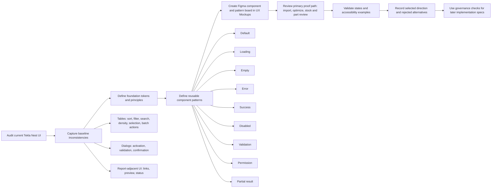

# SPEC-0001: UI Design System

- **Status**: Draft
- **Owner**: Product, UX, and Engineering
- **Created**: 2026-05-16
- **Last updated**: 2026-05-16
- **Target device(s)**: Windows desktop (1440px baseline, 1366px minimum, high-DPI scaling)
- **Related ADRs**: n/a
- **Related issues / PRs**: n/a
- **Source pitch**: docs/pitches/2026-05-16-pitch-0001-design-refactor.md
- **Pitch impact**: IMP-001

---

## 1. Summary

This spec defines a lightweight PySide6 design system for Tekla Nest, a Windows desktop application used by fabrication planners to optimize stock and cuts and review nesting outputs. The design system will establish shared visual principles, reusable component and pattern guidance, Figma pre-visualization artifacts, and governance rules before implementation work begins. The intent is to make future UI modernization modern, clean, accessible, resilient, and consistent without changing optimization logic, service interfaces, or individual workflow behavior in this spec.

## 2. Motivation

Tekla Nest currently needs a shared design foundation before UI modernization proceeds. Without common tokens, component patterns, table behavior standards, and governance checks, future redesign work risks inconsistent dialogs, forms, tables, toolbars, reports-adjacent UI, and activation or licensing experiences.

Evidence and inputs for this phase:

- The pitch identifies the need for a lightweight PySide6 design system that supports modern, clean, accessible, and resilient UI modernization.
- Target users are fabrication planners optimizing stock and cuts and reviewing outputs.
- The affected surface is all app UI, including dialogs and activation/licensing, but this spec does not redesign individual workflows.
- Baseline UI evidence does not yet exist, so the spec requires discovery and audit activities before final component decisions are finalized.
- Tekla Structures visual direction should be reviewed through publicly available Tekla product imagery and docs, plus the current Tekla Nest UI. Current PM-level guidance is to translate Tekla Structures' professional engineering presentation style into Tekla Nest principles without copying exact product UI or committing to an unverified palette. Exact Tekla screenshots and palette extraction are a UX follow-up.
- A Figma component and pattern board is required before implementation, covering color, typography, tables, dialogs, forms, toolbars, states, and accessibility examples.

## 3. Goals

- Establish foundation tokens and visual principles for a Windows PySide6 desktop UI.
- Define reusable component guidance for buttons, forms, dialogs, tables, navigation, status messaging, toolbar patterns, and report-adjacent UI.
- Define table behavior standards for sorting, filtering/search, readable density, useful selection, and batch actions.
- Require Figma pre-visualization mockups before implementation decisions are committed.
- Translate Tekla Structures color and presentation insights into appropriate Tekla Nest visual principles.
- Require an audit-first approach to identify baseline UI inconsistencies.
- Define success measures for UI consistency, component reuse, task completion time, usability issue reduction, and accessibility checklist pass rate.
- Keep this spec limited to design system and UX artifact definition, with production implementation deferred to later specs.

## 4. Non-Goals

- Redesign individual product workflows in detail.
- Change optimization logic.
- Change service interfaces.
- Expand beyond Windows with Tekla integration.
- Implement production code, production styles, shared widgets, or application behavior in this spec.
- Define database schemas, data models, migrations, or storage structures.
- Replace later UX design work, accessibility validation, or architecture review.

## 5. User Stories

- As a **fabrication planner**, I want Tekla Nest screens to use consistent layout, controls, and status language, so that I can move between planning, optimization review, reports, dialogs, and licensing tasks without relearning each surface.
- As a **fabrication planner**, I want tables to behave consistently for sorting, searching, filtering, selection, and batch actions, so that I can review stock, parts, and outputs efficiently.
- As a **fabrication planner**, I want a clean and professional visual presentation aligned with engineering workflows, so that the app feels trustworthy during production planning.
- As a **product team member**, I want a Figma component and pattern board before implementation, so that visual direction can be reviewed and refined before production code is changed.
- As a **developer**, I want reusable PySide6 component and pattern requirements, so that later implementation can modernize the UI consistently without changing service behavior unnecessarily.
- As a **QA or release reviewer**, I want audit and governance criteria for UI consistency, so that future UI changes can be checked against the design system.

## 6. Requirements

### Functional

> Filled by Drake during pm-brief. Tag each requirement with its scope: `*(S1)*`, `*(S2)*`, etc.

- [ ] FR-1 *(S1)*: Define foundation visual principles for Tekla Nest covering professional engineering presentation, clarity, hierarchy, density, consistency, resilience, and appropriate influence from Tekla Structures.
- [ ] FR-2 *(S1)*: Define required foundation token categories for later design and implementation, including color roles, typography roles, spacing roles, radius roles, border roles, elevation or separation roles, and semantic status roles.
- [ ] FR-3 *(S1)*: Document how Tekla Structures color and presentation insights should influence Tekla Nest without requiring direct visual copying or unverified palette adoption.
- [ ] FR-4 *(S2)*: Define reusable component guidance for buttons, forms, dialogs, navigation, status messaging, report-adjacent UI, and toolbar patterns.
- [ ] FR-5 *(S2)*: Define table pattern requirements covering sorting, filtering/search, readable density, useful selection, and batch actions.
- [ ] FR-6 *(S2)*: Define component reuse expectations for future PySide6 shared widgets and presenter-view boundaries without requiring production code changes in this spec.
- [ ] FR-7 *(S3)*: Require a Figma component and pattern board before implementation, including color, typography, table, dialog, form, toolbar, state, and accessibility examples.
- [ ] FR-8 *(S3)*: Require Figma visual exploration to compare alternative visual directions and record the selected direction before implementation begins.
- [ ] FR-9 *(S4)*: Define an audit-first process to capture baseline inconsistencies across current Tekla Nest UI surfaces, including dialogs, activation/licensing, tables, toolbars, report preview, and color-related UI.
- [ ] FR-10 *(S4)*: Define governance checks for future UI work, including consistency review, component reuse review, Figma artifact review, and follow-up ownership for unresolved design or architecture questions.
- [ ] FR-11 *(S4)*: Define success measures for the design system using task completion time, usability issue reduction, accessibility checklist pass, UI consistency, and component reuse signals.

### Non-Functional

#### Accessibility (UX)

- [ ] NFR-A1: The design system must target WCAG 2.2 AA-aligned outcomes for Windows desktop UI, including contrast, keyboard access, visible focus, readable text, error identification, and consistent navigation.
- [ ] NFR-A2: All reusable PySide6 patterns must define keyboard-only operation, including tab order, focus entry/exit behavior, default actions, escape/cancel behavior for dialogs, and non-pointer access to table actions.
- [ ] NFR-A3: Interactive components must provide visible focus indicators that remain clear in default, hover, selected, disabled, validation-error, and Windows high contrast modes.
- [ ] NFR-A4: Qt widgets and future shared components must expose meaningful accessible names, roles, states, descriptions, and value changes through Qt accessibility APIs where supported.
- [ ] NFR-A5: Tables must support screen-reader understandable headers, row/column context, selection state, sort state, filter/search state, empty state, loading state, and partial-result state.
- [ ] NFR-A6: Visual tokens must include semantic roles for default, emphasis, selected, warning, error, success, disabled, focus, and information states without relying on color alone.
- [ ] NFR-A7: The system must support Windows high contrast and user-adjusted display settings without hiding critical controls, status messages, table content, or focus outlines.
- [ ] NFR-A8: Typography, spacing, and component sizing must remain usable at the 1440px baseline, 1366px minimum width, and common Windows high-DPI scaling settings.
- [ ] NFR-A9: Desktop target sizing must provide practical pointer and keyboard usability for dense engineering workflows; compact density is allowed only when focus, selection, and hit targets remain clear.
- [ ] NFR-A10: Loading and long-running states must communicate progress, blocked/unblocked interaction, expected user wait, and recovery options where available.
- [ ] NFR-A11: Motion and feedback must be reduced-motion safe; status changes may use color, iconography, text, and layout but must not depend on animation to convey meaning.
- [ ] NFR-A12: Validation and error patterns must identify the affected field or table row, explain the problem in plain language, preserve user input where safe, and provide a clear recovery action.
- [ ] NFR-A13: Disabled and permission-unavailable actions must explain why the action is unavailable when the reason is not obvious from context.
- [ ] NFR-A14: Figma design artifacts must include accessibility examples for focus, high contrast, validation, loading, empty, error, success, disabled, permission, and partial-result states before implementation specs proceed.

#### Performance & Security (Architecture)

- [ ] NFR-K1: UI pattern guidance and later implementation specs must preserve responsive desktop interaction: local UI state changes, focus movement, hover/pressed feedback, menu opening, tab switching, and simple validation feedback should complete within **p50 <= 50ms / p95 <= 100ms** on supported Windows desktop hardware.
- [ ] NFR-K2: Table-heavy surfaces must remain usable at the stated desktop target: sorting, filtering/searching, selection count updates, validation marker updates, and state-banner updates should complete within **p50 <= 100ms / p95 <= 250ms** for representative datasets up to **10,000 rows per table**, with larger datasets requiring explicit virtualization/pagination review in later implementation specs.
- [ ] NFR-K3: Blocking operations represented by the design system, including activation, import/export, report generation, and optimization, must show user-visible progress or busy feedback within **<= 250ms** of action start and must guard duplicate submission while work is active.
- [ ] NFR-K4: Long-running operations must not freeze the Qt event loop for more than **100ms continuous main-thread blocking** during normal interaction; later implementation specs must move blocking work off the UI thread or chunk it safely.
- [ ] NFR-K5: Design-system patterns must treat license keys, activation responses, machine identifiers, file paths, imported part/stock data, report contents, and Tekla integration context as sensitive desktop application data: do not expose secrets in UI logs, status messages, screenshots, prototypes, or telemetry.
- [ ] NFR-K6: User-provided or imported text displayed in tables, report preview, dialogs, status regions, or `QTextBrowser`-style rich content must be escaped, sanitized, or constrained so malformed HTML, oversized values, custom links, and unexpected URI schemes cannot execute unintended behavior.
- [ ] NFR-K7: Report-adjacent links, including `reorder://...`-style interactions, must use an allowlisted command model and reject unknown schemes, malformed identifiers, duplicate commands while processing, and stale row references.
- [ ] NFR-K8: Later implementation specs must define maximum accepted input sizes before build: table import row count, cell text length, report preview HTML/image size, color-token text length, and license-key length. Until those values are confirmed, prototype examples must use safe representative data only.
- [ ] NFR-K9: Accessibility support must not be optional performance work: accessible names, roles, states, descriptions, focus updates, and state announcements must be updated in the same UI transaction as the visible state change, with no separate delayed path.
- [ ] NFR-K10: No new network service, database, cloud dependency, or service interface is introduced by this design-system spec. Any later production implementation that adds one must trigger a separate architecture review for auth, privacy, retention, availability, rate limits, and observability.

## 7. Scopes & Acceptance Criteria

> Each scope represents one independently deliverable feature. Drake defines scope shells and functional AC during pm-brief. Ellie appends UX and accessibility AC in the same scope.

### Scope 1: Foundation Tokens and Principles

**Covers:** FR-1, FR-2, FR-3

- [ ] Given **the design system spec is being reviewed**, when **the foundation section is complete**, then **it identifies the required token categories for color, typography, spacing, radius, borders, separation, and semantic status roles**.
- [ ] Given **Tekla Structures product presentation is used as an input**, when **Tekla Nest visual principles are documented**, then **the spec explains which presentation qualities should influence Tekla Nest and which direct copying choices are out of scope**.
- [ ] Given **future UI modernization work depends on shared direction**, when **the foundation principles are used**, then **they provide product-level guidance for clean, professional, consistent Windows desktop UI decisions**.
- [ ] Given **the design system defines color roles**, when **a UI state is represented**, then **color is paired with text, iconography, shape, or placement so meaning is not conveyed by color alone**.
- [ ] Given **the application is used on Windows desktop**, when **typography and spacing tokens are defined**, then **they support a 1440px baseline, 1366px minimum width, and common high-DPI scaling without clipping primary content**.
- [ ] Given **WCAG 2.2 AA alignment is required**, when **foreground, background, border, focus, selection, warning, error, and success tokens are proposed**, then **contrast expectations are documented for normal, large, disabled, and non-text UI states**.
- [ ] Given **Tekla Structures is used as visual inspiration**, when **palette or presentation principles are translated**, then **exact screenshots, extracted colors, and adaptation rules are captured in UX artifacts before production adoption**.
- [ ] Given **the current theme uses primary, accent, and background colors**, when **token roles are defined**, then **the design system distinguishes semantic roles from brand/accent roles so status and action meaning are not overloaded**.

### Scope 2: Reusable Component Patterns

**Covers:** FR-4, FR-5, FR-6

- [ ] Given **future UI work includes common PySide6 surfaces**, when **component pattern guidance is complete**, then **it covers buttons, forms, dialogs, navigation, status messaging, report-adjacent UI, and toolbar patterns**.
- [ ] Given **future UI work includes data-heavy screens**, when **table pattern guidance is complete**, then **it covers sorting, filtering/search, readable density, useful selection, and batch actions**.
- [ ] Given **future implementation will use shared UI internals where appropriate**, when **component reuse expectations are reviewed**, then **the spec identifies reuse expectations without requiring production code changes in this spec**.
- [ ] Given **a user navigates by keyboard only**, when **they move through buttons, forms, dialogs, tables, toolbars, tabs, report links, and activation controls**, then **focus order is logical, visible, and recoverable without pointer input**.
- [ ] Given **a table-heavy surface is displayed**, when **sorting, filtering, searching, selection, or batch actions are available**, then **the available affordances are visible, consistently placed, and announced with current state**.
- [ ] Given **a table is loading, empty, errored, filtered to no results, partially loaded, or permission-limited**, when **the state appears**, then **the table region provides clear text, recovery action where available, and preserves layout stability**.
- [ ] Given **a dialog asks for user input or confirmation**, when **validation fails or a blocking operation is in progress**, then **the affected control receives focus or is referenced by focus, action buttons reflect availability, and the user receives plain-language guidance**.
- [ ] Given **status messaging appears in toolbar, dialog, table, or report-adjacent contexts**, when **success, warning, error, or progress feedback is shown**, then **the message is persistent long enough to be read and does not depend on transient animation**.
- [ ] Given **report-adjacent UI includes embedded links or reorder actions**, when **the user interacts with those actions**, then **keyboard activation, focus return, and screen-reader naming are defined**.

### Scope 3: Figma Visual Exploration

**Covers:** FR-7, FR-8

- [ ] Given **implementation has not started**, when **the Figma artifact is prepared**, then **it includes component and pattern examples for color, typography, tables, dialogs, forms, toolbars, states, and accessibility examples**.
- [ ] Given **multiple visual directions may be possible**, when **Figma exploration is complete**, then **the selected visual direction and rejected alternatives are recorded for later implementation planning**.
- [ ] Given **the team needs alignment before code changes**, when **the Figma board is reviewed**, then **it provides enough visual reference for later scoped implementation specs to proceed**.
- [ ] Given **no Figma board exists during UX Brief**, when **UX Mockups begins**, then **the board is created as a component and pattern board rather than as a detailed redesign of individual product workflows**.
- [ ] Given **the primary proof path is table-heavy import, optimize, stock/part review**, when **Figma exploration is produced**, then **it includes representative table, toolbar, status, dialog, licensing, and report-adjacent examples**.
- [ ] Given **full reusable-state coverage is required**, when **the Figma board is reviewed**, then **loading, empty, error, success, disabled, validation, permission, and partial-result states are represented or explicitly marked not applicable with rationale**.
- [ ] Given **external desktop or engineering-product patterns may be useful**, when **they are referenced in Figma**, then **they are labelled as candidates requiring Section 13 decision before production adoption**.
- [ ] Given **accessibility examples are part of the Figma board**, when **focus, high contrast, screen-reader labels, scalable text, and reduced-motion-safe feedback are represented**, then **the board provides enough implementation guidance for later specs**.

### Scope 4: Governance and Audit

**Covers:** FR-9, FR-10, FR-11

- [ ] Given **baseline UI evidence is not yet available**, when **the audit activity is completed**, then **it records current inconsistencies across the agreed app UI scope**.
- [ ] Given **future UI changes are proposed**, when **governance checks are applied**, then **the proposed change can be assessed for consistency, component reuse, and Figma alignment**.
- [ ] Given **the design system needs measurable outcomes**, when **success measures are defined**, then **they include task completion time, usability issue reduction, accessibility checklist pass, UI consistency, and component reuse signals**.
- [ ] Given **the current UI uses a three-panel splitter with tables and report preview**, when **audit findings are documented**, then **table affordances, toolbar/menu actions, report links, dialogs, color configuration, and activation flows are included**.
- [ ] Given **current tables do not show explicit sorting, filtering, search, density, selection, or batch-action affordances in source observations**, when **table standards are governed**, then **those affordances are reviewed before future modernization work changes table behavior**.
- [ ] Given **governance checks are applied to future UI work**, when **a component deviates from the design system**, then **the deviation records rationale, accessibility impact, reuse impact, and follow-up owner**.
- [ ] Given **accessibility checklist pass rate is a success signal**, when **a future UI change is reviewed**, then **keyboard access, focus visibility, high contrast, screen-reader semantics, scalable text/high-DPI, and reduced-motion-safe feedback are checked**.
- [ ] Given **baseline audit and Figma artifacts are prerequisites for production UI modernization**, when **implementation specs are proposed**, then **unresolved UX follow-ups from Section 13 are reviewed for impact before build decisions are made**.

## 8. Design

### Tech Stack

| Layer | Technology | Notes |
|-------|------------|-------|
| Framework baseline | PySide6 / Qt Widgets | Existing GUI framework and current app evidence. Remains the default for implementation specs because current shell, tables, dialogs, toolbar, and report preview are widget-based. |
| Optional future exploration | QML / Qt Quick | Allowed by Q-028 only if a later implementation spec proves benefit. Trade-off: stronger declarative UI/state modeling and animation control vs migration cost, mixed-stack complexity, accessibility retesting, and higher maintenance burden. Not production work in this spec. |
| Component library | Tekla Nest shared PySide6 patterns | Prefer shared widgets, delegates, models, presenter-view boundaries, and design tokens before adopting external component libraries. |
| Language | Python | Existing runtime context. No production code changes in this spec. |
| Styling | Qt stylesheets plus widget configuration; possible token-to-stylesheet generation later | Best fit for current Qt Widgets baseline. Must avoid one-off styling in individual screens. |
| Rich preview / report-adjacent UI | Existing `QTextBrowser`-style preview pattern | Keep only with command allowlisting, sanitized content, keyboard-accessible links, and explicit accessible names. |
| Testing support | pytest / pytest-qt | Later implementation specs should include UI behavior, accessibility-state, and regression tests for shared patterns. |
| Target platform | Windows desktop with Tekla integration | 1440px baseline, 1366px minimum, high-DPI scaling, Windows High Contrast compatibility. |

### Approach

The UX approach is audit-first and pattern-led. This spec defines how Tekla Nest should become more consistent before any production UI is changed.

The primary proof path is the table-heavy planning flow: importing or preparing parts, optimizing, reviewing stock and part tables, and checking report-adjacent output. This path is the best design-system proving ground because it contains the highest-density interaction patterns: editable tables, splitter-based layout, toolbars, status feedback, selection, sorting, filtering/search, batch actions, report links, and long-running optimization feedback.

The design system should preserve the product's Windows desktop character while improving clarity, hierarchy, accessibility, and resilience. The current three-panel model - Parts Table, Stock Tabs, and Report Preview - should be treated as source evidence, not as a final layout decision. Future Figma exploration should test whether the existing shell remains appropriate or whether alternative desktop patterns better support fabrication planners.

Reusable patterns should be defined around:

- foundation tokens for color, typography, spacing, radius, borders, separation, focus, and semantic status;
- tables with explicit sorting, filtering/search, density, selection, batch action, loading, empty, error, and partial-result behavior;
- dialogs for activation, validation, destructive or blocking actions, and confirmation;
- forms with clear labels, validation recovery, keyboard order, and disabled-state rationale;
- toolbars and menus with consistent command grouping and discoverable availability;
- status messaging for progress, success, warning, error, and information states;
- report-adjacent UI where links and embedded actions remain keyboard and screen-reader accessible.

Loading strategy is context-dependent. Blocking optimization or activation work should use clear progress indicators with explanatory text and unavailable actions. Table or control-specific work should use inline busy states. Skeleton-like placeholders should be used only where they preserve layout stability and do not imply false data precision.

Every reusable pattern must define default, loading, empty, error, success, disabled/unavailable, validation-error, permission-denied, and partial-result states where applicable. If a state does not apply, the artifact must state why.

Tekla Structures should influence Tekla Nest through professional engineering presentation qualities: calm visual hierarchy, restrained color, clear data density, robust table presentation, and trustworthiness. Direct copying of Tekla product UI or adopting an unverified palette is out of scope until UX Mockups captures exact screenshots, palette evidence, and adaptation rules.

External UI patterns may be considered as candidates when they better fit data-heavy Windows desktop workflows. They must not be silently adopted. Any candidate pattern selected for production use must be recorded in Section 13 with rationale and accessibility impact.

### API / Interface

No external service API changes are introduced by this spec.

Later implementation specs should define UI-internal contracts at the pattern level:

```text
DesignTokenProvider
- Supplies semantic color, typography, spacing, border, radius, focus, density, and status roles.
- Does not expose brand/accent roles as semantic state roles.

SharedTablePattern
- Inputs: table model, column metadata, validation rules, optional selection model, optional filter/sort model.
- Outputs/events: sortChanged, filterChanged, selectionChanged, cellEditRequested, cellValidationFailed, stateChanged.
- Error model: invalid input, oversized input, load failure, partial result, permission unavailable, stale row reference.
- Accessibility: table title, row/column context, sort state, selection count, validation state, loading/empty/error/partial-result announcements.

DialogPattern
- Inputs: title, description, fields, validation rules, primary/secondary actions, blocking-operation state.
- Outputs/events: accepted, rejected, validationFailed, operationStarted, operationSucceeded, operationFailed.
- Error model: required field, malformed value, permission unavailable, duplicate submit, operation failure.
- Accessibility: focus trap, initial focus, default action, Escape behavior, error focus recovery.

StatusPattern
- Inputs: level, message, affected region, optional recovery action, persistence policy.
- Levels: info, loading, success, warning, error, permission.
- Accessibility: non-color-only visible treatment and screen-reader announcement where applicable.

ReportActionPattern
- Inputs: allowlisted command, target identifier, current row/order context.
- Outputs/events: commandAccepted, commandRejected, commandCompleted, commandFailed.
- Error model: malformed command, unknown scheme, stale target, duplicate action, partial failure.
```

Auth model: n/a for design-system artifacts; existing activation/licensing remains an app concern and must not be broadened here.

Idempotency: later UI actions that can be triggered repeatedly must guard duplicate submission while active, especially activation, import/export, calculate, report generation, and reorder.

Rate limits: local UI actions should debounce search/filter input to **150-300ms** in later implementation specs; expensive operations should reject or queue duplicate invocations rather than launch concurrent work.

### Data Model

No database schema, persistent storage model, or migration is introduced by this spec.

Design-system artifacts should define non-persistent UI model shapes only:

```text
DesignToken {
  role: semantic role name
  value: visual value or system-derived value
  accessibilityNote: contrast/high-contrast/scaling expectation
}

ComponentState {
  component: button | table | dialog | form | toolbar | status | report-adjacent
  state: default | loading | empty | error | success | disabled | validation | permission | partial-result
  message: visible text
  recoveryAction: optional action
  accessibilityBehavior: focus/announcement/name/role requirement
}

TableColumnPattern {
  key
  label
  dataType
  sortable: boolean
  filterable: boolean
  editable: boolean
  validationRule: optional
  accessibleDescription: optional
}

GovernanceFinding {
  surface
  deviation
  rationale
  accessibilityImpact
  reuseImpact
  owner
  milestone
}
```

Migrations needed: n/a — no production data changes.

Backfill plan: n/a — no persisted records are introduced or modified.

### Diagram



Prototype: docs/specs/spec-0001/prototypes/.

#### System Sequence

```mermaid
sequenceDiagram
    participant User
    participant Shell as Qt Widgets Shell
    participant Patterns as Shared UI Patterns
    participant Tokens as Design Token Provider
    participant Model as Existing UI Models / Presenters
    participant Report as Report Preview / Action Handler

    User->>Shell: Open design-system-backed surface
    Shell->>Tokens: Resolve semantic tokens and density rules
    Tokens-->>Shell: Colors, typography, spacing, focus, status roles

    Shell->>Patterns: Render table/dialog/toolbar/status pattern
    Patterns->>Model: Read existing UI state
    Model-->>Patterns: Data, validation state, permissions, operation state
    Patterns-->>Shell: Visible UI + accessible names/roles/states

    User->>Patterns: Sort/filter/edit/select/calculate/export/reorder
    Patterns->>Patterns: Validate input, debounce where needed, guard duplicates
    alt Valid local UI action
        Patterns->>Model: Dispatch presenter/view event
        Model-->>Patterns: Success, error, loading, or partial-result state
        Patterns-->>Shell: Update UI state and accessibility announcement
    else Malformed, oversized, stale, or permission-limited action
        Patterns-->>Shell: Show inline/status error and focus recovery
    end

    User->>Report: Activate report-adjacent link
    Report->>Report: Allowlist scheme and target identifier
    alt Command accepted
        Report->>Model: Dispatch reorder/export action
        Model-->>Report: Completed or failed state
        Report-->>Shell: Update preview/status/focus
    else Command rejected
        Report-->>Shell: Error status; no side effect
    end
```

## 9. Alternatives Considered

- **Option A: Implement screen-by-screen redesign without a design system** - Pros: faster start on visible screens; fewer upfront artifacts. Cons: high risk of inconsistent UI, duplicated patterns, weak accessibility coverage, and rework across dialogs, tables, reports, and licensing flows. Not chosen because the pitch explicitly requires a reusable design system foundation before implementation.
- **Option B: Adopt Tekla Structures visual style directly** - Pros: stronger brand familiarity for users already exposed to Tekla products. Cons: risks copying presentation patterns that may not fit Tekla Nest's PySide6 desktop workflow, current codebase, or product scope; exact Tekla palette has not been audited yet. Not chosen because Tekla Structures should inform principles, not be copied without UX validation.
- **Option C: Create a comprehensive enterprise design system before any feature work** - Pros: broad coverage and stronger long-term governance. Cons: too large for the current appetite and likely to delay practical UI modernization. Not chosen because the pitch asks for a lightweight PySide6 design system with independently shippable scopes.

## 10. Edge Cases & Failure Modes

- **Malformed or oversized input**
  - License keys, color values, table cell edits, imported CSV values, report HTML, image references, and custom report links may be empty, malformed, unexpectedly long, or hostile.
  - Required handling: validate before commit, preserve user input where safe, show plain-language error near the affected field/row, cap rendered text length, sanitize rich content, reject unknown URI schemes, and keep focus on or near the recovery action.
  - Later implementation specs must set numeric caps for import rows, cell length, report preview size, and image payload size before build.

- **Partial failure**
  - Import, optimization, report generation, or export may complete with warnings or partial results.
  - Required handling: do not collapse partial success into a generic error. Show warning status, affected row markers, report-adjacent context, recovery path, and screen-reader announcement such as `Calculation completed with warnings. Review highlighted rows.`

- **Concurrency / race conditions**
  - Users may trigger calculate, import, activation, export, color apply, or reorder multiple times before the previous operation completes.
  - Required handling: disable or queue duplicate actions while active, use operation identifiers or current-state checks before applying results, reject stale row/report commands, and keep status updates tied to the latest accepted operation.

- **Rate limiting / abuse**
  - Local search/filter, sort toggles, repeated report reorder links, repeated activation attempts, or rapid import/export triggers can create UI churn or backend/license-server pressure in later implementation.
  - Required handling: debounce local search/filter to **150-300ms**, coalesce repeated sort/filter updates, guard duplicate long-running operations, and avoid logging sensitive repeated inputs.

- **Accessibility-state drift**
  - Visible UI may update without matching accessible name, role, state, description, or announcement.
  - Required handling: treat accessibility updates as part of the same UI state transaction as visual updates; regression-test focus order, names, roles, and state announcements for shared patterns.

- **High-DPI / high-contrast failure**
  - Fixed-height rows, clipped labels, low-contrast borders, or hard-coded colors may fail at Windows scaling or High Contrast mode.
  - Required handling: validate at 1366px minimum width and common high-DPI scaling; use system-derived high-contrast values where appropriate; never communicate state by color alone.

## 11. Rollout Plan

- [ ] Complete S1 foundation tokens and principles as a spec artifact before detailed component or implementation planning.
- [ ] Complete S2 reusable component and table pattern guidance before any later production UI implementation spec is accepted.
- [ ] Complete S3 Figma component and pattern board before implementation work begins; add the Figma link to this spec once available.
- [ ] Complete S4 baseline UI audit and governance checklist before finalizing detailed component decisions.
- [ ] Use later implementation specs to plan production code changes by surface or component set.
- [ ] No feature flag is required for this spec because it produces spec and UX artifacts only.
- [ ] No migration steps are required in this spec.
- [ ] Backward compatibility is maintained because no production behavior changes are included.
- [ ] Rollback plan: if the selected visual direction is rejected, retain the audit and decision log, revise the Figma board, and do not proceed to implementation specs until reviewed.

## 12. Observability

- **Logs**
  - `INFO`: design-system surface opened, selected visual direction loaded, component-pattern version used, non-sensitive operation lifecycle events.
  - `WARN`: validation failure class, rejected report command reason, partial-result state, accessibility metadata missing in test/audit builds.
  - `ERROR`: failed import/export/report generation/activation UI operation, uncaught UI exception, failed token load, failed stylesheet application.
  - Redaction rule: do not log license keys, machine identifiers, imported part/stock row contents, report body content, file contents, or full local paths unless explicitly approved in a later privacy/security review.

- **Metrics**
  - `ui.action.latency_ms`: timer for local UI action feedback; target **p95 <= 100ms** for simple state changes.
  - `ui.table.operation.latency_ms`: timer for sort/filter/selection/validation updates; target **p95 <= 250ms** for representative datasets up to **10,000 rows**.
  - `ui.long_operation.feedback_ms`: time from user action to visible loading/busy feedback; target **<= 250ms**.
  - `ui.validation.failure.count`: count by component and validation class.
  - `ui.operation.duplicate_suppressed.count`: count duplicate activation/calculate/import/export/reorder attempts blocked while active.
  - `ui.partial_result.count`: count partial-result outcomes by operation type.
  - `ui.accessibility.audit.failure.count`: count missing names, roles, focus states, contrast failures, or announcement gaps in automated/manual audit runs.
  - `ui.main_thread.block_ms`: later implementation diagnostic for continuous UI-thread blocking; alert threshold below.

- **Alerts**
  - No production paging is required for this spec because it creates no production runtime changes.
  - Later implementation specs should alert or fail CI when:
    - accessibility audit failures are **> 0** for required shared patterns;
    - UI simple-action latency p95 exceeds **100ms** in regression tests;
    - table operation p95 exceeds **250ms** for the agreed representative dataset;
    - loading feedback takes **> 250ms** after a long-running action starts;
    - main-thread blocking exceeds **100ms** continuously during normal interaction tests;
    - duplicate long-running operations are not suppressed in regression tests.

## 13. Decision & Open Question Register

> Canonical owner for all open questions, resolved decisions, accepted assumptions, and follow-ups discovered during the spec workshop.

| ID | Status | Type | Source | Question / Decision | Recommendation | Answer / Assumption | Owner / Milestone | Impacted artifacts |
|----|--------|------|--------|---------------------|----------------|---------------------|-------------------|--------------------|
| Q-001 | Answered | PM | ask_user PM phase | Scope split | Use four independently shippable scopes to avoid one large design-system deliverable. | Four scopes: S1 foundation tokens/principles, S2 reusable component patterns, S3 Figma visual exploration, S4 governance/audit. | Product / pm-brief | spec.md sections 1, 3, 6, 7, 11, 15 |
| Q-002 | Answered | Cross-functional | ask_user PM phase | Tekla Structures color and presentation insight source | Use public Tekla product imagery/docs plus current Tekla Nest UI, then validate exact palette in UX. | Public Tekla sources and current Tekla Nest UI are the source inputs; exact Tekla screenshots and palette are a UX follow-up. | Ellie / ux-brief | spec.md sections 2, 6, 7; Figma board |
| Q-003 | Answered | UX | ask_user PM phase | Figma artifact requirement | Require Figma pre-visualization before implementation. | Figma component/pattern board must include color, typography, table, dialog, form, toolbar, state, and accessibility examples before implementation. | Ellie / ux-brief | spec.md sections 3, 6, 7, 11; Figma board |
| Q-004 | Answered | Delivery | ask_user PM phase | Implementation scope | Keep this spec to spec and UX artifacts only. | No production code or implementation work in this spec; implementation comes later. | Product / pm-brief | spec.md sections 1, 4, 6, 7, 11 |
| Q-005 | Answered | PM | Pitch PQ-003 | Target users | Anchor design system around fabrication planners. | Target users are fabrication planners optimizing stock/cuts and reviewing outputs. | Product / pitch | spec.md sections 1, 5 |
| Q-006 | Answered | PM | Pitch PQ-005 | Screen scope | Include all app UI so future consistency work is not fragmented. | All app UI is in scope, including dialogs and activation/licensing. | Product / pitch | spec.md sections 2, 3, 6, 7 |
| Q-007 | Answered | PM | Pitch PQ-011 | Visual direction | Use a lightweight PySide6 design system. | Direction is modern, clean, accessible, and resilient. | Product / pitch | spec.md sections 1, 2, 3 |
| Q-008 | Answered | UX | Pitch PQ-012 | Existing UX artifacts | Treat this as a new UX artifact set. | No existing UX artifacts. | Product / pitch | spec.md sections 2, 11 |
| Q-009 | Answered | PM | Pitch PQ-013 | Success signals | Use outcome and quality signals rather than output-only delivery counts. | Task completion time, usability issue reduction, accessibility checklist pass, and UI consistency/component reuse. | Product / pitch | spec.md sections 3, 6, 7 |
| Q-010 | Answered | PM | Pitch PQ-014 | Baseline evidence | Require discovery and audit first. | No baseline evidence yet; include discovery/audit first. | Product / pitch | spec.md sections 2, 6, 7, 11 |
| Q-011 | Answered | Architecture | Pitch PQ-016 | Architecture boundary | Keep UI internals in scope for later review but avoid service interface changes. | UI internals/shared widgets/presenter-view boundaries are in scope; avoid service interface changes unless justified. | Kratos / arch-review | spec.md sections 4, 6, 8 |
| Q-012 | Answered | Delivery | Pitch PQ-021 | Deferred questions | Defer non-blocking questions only with owners. | Deferred items are allowed if each has an owner and is listed as a follow-up decision. | Product / all phases | spec.md section 13 |
| Q-013 | Answered | UX | UX Mockups | Figma board artifact link | Create the design-system component/pattern board content as a durable tool-agnostic mockup specification in UX Mockups; defer external Figma file creation unless requested separately. | `docs/specs/spec-0001/mockups.md` defines the frame inventory, component/state coverage, accessibility expectations, and representative shell composition. No external Figma file was created in this phase per Q-023. | Ellie / ux-mockups | mockups.md; Figma board; spec.md sections 7, 8; ux.md |
| Q-014 | Answered | UX | ask_user UX Mockups | Tekla palette and screenshot evidence | Use current app colors and public Tekla references for this UX Mockups phase, while keeping exact Tekla screenshot/palette capture as evidence to add before production adoption. | User approved unblocking UX Mockups with current app colors and public Tekla references instead of waiting for exact Tekla screenshots/palette samples. | Ellie / ux-mockups | mockups.md; Figma board; spec.md sections 6, 7, 8; ux.md |
| Q-015 | Answered | UX | UX Brief | Accessibility requirements | Use WCAG 2.2 AA-aligned outcomes and Qt accessibility practices covering keyboard, focus, screen-reader semantics, high contrast, high-DPI, reduced motion, target sizing, loading, validation, and table states. | Accessibility NFRs and UX AC have been drafted for UX Brief. | Ellie / ux-brief | spec.md sections 6, 7; ux.md |
| Q-016 | Answered | Architecture | Architecture Review | Implementation approach validation | Validate PySide6 styling, shared widget, presenter-view, performance, and security implications before implementation specs. | Kratos completed architecture validation, keeping PySide6/Qt Widgets as the baseline, allowing QML/Qt Quick only as a later justified candidate, and recording NFR thresholds, contracts, edge cases, observability, and caveats in Technical Considerations. | Kratos / arch-review | spec.md sections 6, 8, 10, 12; Technical Considerations |
| Q-017 | Follow-up | Cross-functional | UX Brief | Baseline UI audit evidence | Use current source observations as initial evidence and complete a broader audit before final component decisions. | Initial observations exist for main window, tables, report preview, activation dialog, color dialog, and theme defaults; full baseline audit is still required. | Product and Ellie / ux-mockups | spec.md sections 7, 8, 11; ux.md |
| Q-018 | Answered | UX | ask_user UX Brief | Target device and viewport | Target Windows desktop with 1440px baseline, 1366px minimum, and high-DPI scaling support. | Confirmed target device and viewport strategy for the design system. | Ellie / ux-brief | spec.md sections 6, 7, 8; ux.md |
| Q-019 | Answered | UX | ask_user UX Brief | Primary design-system proof path | Use table-heavy import, optimize, stock/part review surfaces first, with dialogs/licensing/report-adjacent UI as coverage examples. | Confirmed primary proof path for UX strategy and later Figma board. | Ellie / ux-brief | spec.md sections 7, 8; ux.md; Figma board |
| Q-020 | Answered | UX | ask_user UX Brief | Reusable state coverage | Require full reusable-state coverage: loading, empty, error, success, disabled, validation, permission, and partial-result states. | Confirmed state coverage expectations for components, tables, dialogs, and Figma examples. | Ellie / ux-brief | spec.md sections 6, 7, 8; ux.md; Figma board |
| Q-021 | Answered | UX | ask_user UX Brief | Loading pattern strategy | Use context-dependent loading: progress indicators with clear text for blocking work, inline busy states for controls/tables, and skeleton-like placeholders only where layout stability helps. | Confirmed loading strategy for the design system. | Ellie / ux-brief | spec.md sections 6, 7, 8; ux.md; Figma board |
| Q-022 | Answered | UX | ask_user UX Brief | External pattern candidate policy | Analyze current Tekla Nest UI first; discuss external patterns as candidates when useful and require Section 13 decision before production adoption. | Confirmed that external patterns are references/candidates, not silent defaults. | Ellie / ux-brief | spec.md sections 7, 8, 13; ux.md |
| Q-023 | Answered | UX | ask_user UX Mockups | Mockup artifact mode | Produce the required tool-agnostic `mockups.md` with planned Figma/prototype frame inventory; do not create an external Figma file in this phase. | Confirmed `mockups.md` is the UX Mockups phase artifact and an external Figma file is out of scope for this invocation. | Ellie / ux-mockups | mockups.md; spec.md section 13 |
| Q-024 | Answered | UX | ask_user UX Mockups | Design-system mockup screen inventory | Cover design-system board frames only: foundations, data table system, forms/dialogs, toolbar/status, accessibility/state matrix, plus one representative current-shell composition. | Confirmed screen inventory for `mockups.md`; full workflow screen mockups remain outside this design-system spec. | Ellie / ux-mockups | mockups.md; planned prototype inventory |
| Q-025 | Follow-up | UX | UX Review | Exact Tekla screenshot and palette capture before production adoption | Capture exact Tekla screenshots and palette samples in `docs/specs/spec-0001/references/tekla-screenshots/` or attach them in the workshop session; compare a Tekla-schema-dependent plan against a modern application UI-kit benchmark plan before production visual adoption. | User asked where to provide screenshots and requested two visual-direction plans: one Tekla schema dependent and one based on state-of-the-art modern application UI-kit practice. Current app colors and public Tekla references remain acceptable for UX Review/prototype exploration only; production palette adoption remains blocked until exact evidence is captured and reviewed. | Product and Ellie / before production visual adoption | Figma board; ux.md; mockups.md; later implementation specs |
| Q-026 | Assumption | UX | UX Review | HTML prototype shell usage for design-system board frames | Use the shared application shell wrapper for every HTML prototype screen to satisfy cross-spec prototype consistency, while treating board/reference frames as design-system content rather than product workflow screens. | Accepted as a prototype-format assumption because UX Prototype phase rules require every screen HTML file to render the shared shell even when `mockups.md` lists product shell usage as omitted for board frames. | Ellie / ux-review | mockups.md; prototypes; docs/specs/_prototype-shell.html |
| Q-027 | Answered | UX | ask_user UX Review | Awwwards-informed color schema refinement | Apply the Modern SaaS/data-product direction using off-white/slate surfaces, deep blue primary actions, teal/cyan accents, compact rounded controls, and strong table readability. | User selected the Modern SaaS/data-product direction after Awwwards source review. The previous current-app blue/orange schema should remain evidence only, not the selected prototype palette. | Ellie / ux-review | ux.md; mockups.md; prototypes; spec.md section 13 |
| Q-028 | Answered | Architecture | ask_user Architecture Review | UI platform flexibility for later implementation | Allow Kratos to consider QML / Qt Quick only if justified, while preserving the existing PySide6/Qt Widgets stack as the baseline. | User approved allowing QML / Qt Quick if Kratos finds it beneficial. Any such recommendation must preserve scope boundaries, explain migration cost, and avoid production implementation in this spec. | Kratos / arch-review | spec.md sections 6, 8, 10, 12; Technical Considerations |
| Q-029 | Answered | Architecture | Architecture Review | Qt Widgets baseline vs QML / Qt Quick option | Keep PySide6/Qt Widgets as the implementation baseline; allow QML / Qt Quick only as a later candidate if a scoped implementation spec proves benefit over migration and accessibility retest cost. | PySide6/Qt Widgets remains baseline. QML/Qt Quick is permitted only as future exploration and does not add production work to this spec. | Kratos / arch-review | spec.md sections 6, 8; Technical Considerations |
| Q-030 | Follow-up | Architecture | Architecture Review | Production input-size caps for tables, text fields, report preview, images, and license keys | Define caps in later implementation specs before build because they affect validation, performance, and security hardening. | This design-system spec uses safe representative data only; exact limits remain follow-up before production implementation. | Engineering / later implementation specs | spec.md sections 6, 10, 12; later implementation specs |
| Q-031 | Follow-up | Architecture | Architecture Review | Rich report preview and custom link hardening | Use sanitized/escaped rich content and allowlisted report commands; reject unknown schemes, malformed identifiers, stale targets, and duplicate actions. | Required as a later implementation constraint; no production code changes in this spec. | Engineering / later implementation specs | spec.md sections 6, 8, 10, 12; later implementation specs |
| Q-032 | Answered | Architecture | Architecture Review | Architecture NFR thresholds for design-system implementation planning | Use measurable desktop UI thresholds for feedback latency, table operations, loading feedback, and UI-thread blocking. | Proposed thresholds recorded: simple UI p95 <= 100ms, table ops p95 <= 250ms for representative 10,000-row datasets, loading feedback <= 250ms, main-thread blocking <= 100ms. | Kratos / arch-review | spec.md sections 6, 12; Technical Considerations |

## 14. Implementation Notes

> Filled during implementation. Capture deviations, gotchas, and follow-ups.

- _(empty until implementation begins)_

## 15. Spec Revision Log

> Tracks how this living spec evolves from pitch-driven changes.

| Revision | Source pitch | Pitch impact | Summary of change | Impacted scopes | Status |
|----------|--------------|--------------|-------------------|-----------------|--------|
| R1 | docs/pitches/2026-05-16-pitch-0001-design-refactor.md | IMP-001 | Initial creation of ui-design-system spec with PM brief, four shippable scopes, functional requirements, Figma artifact requirement, Tekla Structures presentation insight handling, rollout plan, and decision register. | S1, S2, S3, S4 | Draft |
| R2 | docs/pitches/2026-05-16-pitch-0001-design-refactor.md | IMP-001 | Added UX Brief accessibility NFRs, UX acceptance criteria, UX approach and diagram, Design Decision Record, target viewport, state coverage, loading strategy, external pattern policy, and UX follow-up decisions. | S1, S2, S3, S4 | Draft |
| R3 | docs/pitches/2026-05-16-pitch-0001-design-refactor.md | IMP-001 | Recorded UX Mockups phase decisions for artifact mode and screen inventory, and captured visual-source handling for current app colors, public Tekla references, and later exact Tekla evidence capture. | S3, S4 | Draft |
| R4 | docs/pitches/2026-05-16-pitch-0001-design-refactor.md | IMP-001 | Created tool-agnostic design-system mockup specification with foundation, table, dialog/form, toolbar/status, accessibility/state, and representative shell frames. | S1, S2, S3, S4 | Draft |
| R5 | docs/pitches/2026-05-16-pitch-0001-design-refactor.md | IMP-001 | Refined UX Review visual direction using Awwwards-informed modern SaaS/data-product palette and component styling while keeping Tekla palette evidence as a production follow-up. | S1, S2, S3 | Draft |
| R6 | docs/pitches/2026-05-16-pitch-0001-design-refactor.md | IMP-001 | Added Architecture Review NFR thresholds, UI-internal contracts, data model shapes, edge cases, observability, platform fit, and Technical Considerations. | S1, S2, S3, S4 | Draft |

## 16. References

- Awwwards Clean websites tag: https://www.awwwards.com/websites/clean/
- Awwwards Minimal websites tag: https://www.awwwards.com/websites/minimal/
- Awwwards Colorful websites tag: https://www.awwwards.com/websites/colorful/
- Awwwards Typography websites tag: https://www.awwwards.com/websites/typography/
- Awwwards UI Design websites tag: https://www.awwwards.com/websites/ui-design/
- Awwwards Data Visualization websites tag: https://www.awwwards.com/websites/data-visualization/
- Awwwards Gradients in Web Design Elements: https://www.awwwards.com/gradients-in-web-design-elements.html

## Technical Considerations

### UX Design Acknowledgement

- User flow steps from Ellie's `### Approach` and UX diagram:
  1. Audit current Tekla Nest UI.
  2. Capture baseline inconsistencies.
  3. Define foundation tokens and principles.
  4. Define reusable component patterns.
  5. Create the Figma/component-pattern board in UX Mockups.
  6. Review the primary proof path: import, optimize, stock and part review.
  7. Validate reusable states and accessibility examples.
  8. Record selected direction and rejected alternatives.
  9. Use governance checks for later implementation specs.

- UX AC items with architectural implications:
  - S1: non-color-only state communication; 1440px/1366px/high-DPI support; contrast expectations; Tekla palette evidence gate; semantic roles separate from brand/accent roles.
  - S2: reusable PySide6 surfaces; table sorting/filtering/search/selection/batch actions; future shared UI internals; keyboard-only operation; visible/announced table state; loading/empty/error/partial/permission handling; dialog focus and validation; persistent status messaging; report-link keyboard and screen-reader behavior.
  - S3: artifact coverage for components/states/accessibility; selected/rejected visual directions; table-heavy proof path; full reusable-state coverage; external patterns labelled as candidates; implementation-ready focus/high-contrast/screen-reader/scaling/reduced-motion guidance.
  - S4: baseline audit of tables, toolbar/menu, report links, dialogs, color configuration, and activation; governance checks; deviation records with accessibility/reuse impact; accessibility checklist review before future implementation.

- Ellie's accessibility NFRs and required support:
  - WCAG 2.2 AA alignment, keyboard-only operation, visible focus, logical tab order, Qt accessible names/roles/states/descriptions, Windows High Contrast, scalable text/high-DPI, reduced-motion-safe feedback, non-color-only statuses, validation recovery, table semantics, disabled/permission explanations, and loading/error/success/partial-result announcements.
  - Backend/infrastructure support required: none for this spec. Later implementation support is UI/platform-level: Qt accessibility metadata, sanitized rich preview content, presenter/model state exposed to shared widgets, deterministic validation state, safe operation status, and audit/test hooks.

- Architecture-relevant UX artifacts:
  - `ux.md` selects Windows desktop, table-heavy proof path, full reusable-state coverage, context-dependent loading, and modern SaaS/data-product visual direction.
  - `mockups.md` defines F01-F06 frames, table/dialog/status/report-adjacent states, keyboard behavior, accessibility expectations, and prototype references.
  - Prototype manifest provides architecture evidence for screen/state coverage: `prototype-foundations.html`, `prototype-data-table-system.html`, `prototype-forms-dialogs.html`, `prototype-toolbar-status.html`, `prototype-accessibility-state-matrix.html`, `prototype-representative-shell.html`, plus shared `styles.css`.

- Architectural constraints affecting Ellie's flows:
  - No blocker. Existing PySide6/Qt Widgets can support the specified flows if later implementation uses shared patterns, avoids UI-thread blocking, sanitizes report-adjacent rich content, and treats accessibility metadata as first-class state.

### 1. System context

- Services touched:
  - No production services in this spec.
  - Later implementation may touch existing UI shell, presenters/view models, activation/licensing UI, import/export UI, report preview UI, and table models.

- Data stores touched:
  - n/a — no storage or migrations in this spec.

- External APIs:
  - n/a for this spec.
  - Existing activation/Tekla integration remain out of scope unless a later implementation spec changes contracts.

### 2. Data-model delta

- New / changed entities:
  - No persisted entities.
  - Proposed UI-only model shapes: design tokens, component states, table column metadata, governance findings.

- Migrations needed:
  - n/a — no database/schema change.

- Backfill plan:
  - n/a — no persisted records.

### 3. Non-functional requirements

- Latency budget (p50 / p95):
  - Simple UI state changes: **p50 <= 50ms / p95 <= 100ms**.
  - Table sort/filter/selection/validation updates: **p50 <= 100ms / p95 <= 250ms** up to representative **10,000-row** datasets.
  - Loading feedback after long-running action: **<= 250ms**.
  - Continuous UI-thread blocking: **<= 100ms**.

- Throughput target:
  - Local desktop UI; no server throughput target.
  - Later table patterns should be reviewed against up to **10,000 rows per table** before virtualization/pagination decisions.

- Availability target:
  - n/a — design-system artifact only, no runtime service.
  - Later UI implementation should degrade locally: failed token/style load must not prevent app startup.

- Retention:
  - n/a — no new telemetry or persisted records in this spec.

- Cost ceiling:
  - n/a — no new infrastructure or paid dependency introduced.

### 4. Integration points

- API contract shape:
  - No external API changes.
  - UI-internal contracts should be event/state based: token provider, table pattern, dialog pattern, status pattern, report action pattern.

- Auth model:
  - Existing activation/licensing only. No auth expansion in this spec.

- Idempotency:
  - Duplicate long-running actions must be guarded: activation, import, calculate, export, report generation, reorder.

- Rate limits:
  - Debounce search/filter to **150-300ms** in later implementation.
  - Suppress duplicate long-running operations while active.

### 5. Cross-cutting concerns

- Observability:
  - Logs, metrics, and CI/audit thresholds defined in Section 12.

- Feature flags / kill switches:
  - n/a for this spec.
  - Later implementation may need per-surface rollout flags if production UI changes are staged.

- Audit log:
  - n/a for design artifacts.
  - Governance findings should be recorded in spec/design-system process artifacts, not runtime audit logs.

- Privacy / data classification:
  - Treat license keys, activation responses, machine identifiers, imported part/stock data, report contents, local file paths, and Tekla context as sensitive desktop app data.
  - Do not include sensitive data in prototypes, screenshots, logs, or telemetry.

### 6. Platform fit (omni-iac)

- Rule 4 (naming): n/a — no Azure/resource naming or infrastructure introduced.
- Rule 5 (shared user-assigned MI for ACR + Key Vault): n/a — no ACR, Key Vault, or managed identity touched.
- Rule 6 / ADR-0003 (two-phase container-app deploy): n/a — no container app deployment.
- Rule 8 (IP allowlist single source of truth): n/a — no networking or allowlist change.

### 7. Risks & open technical questions

- [Risk] — Qt Widgets stylesheets can become brittle if applied ad hoc per screen; use shared tokens/patterns before implementation — owner: Kratos / later implementation specs.
- [Risk] — `QTextBrowser`/rich report preview and custom links can become an injection or stale-command surface unless allowlisted and sanitized — owner: Engineering / later implementation specs.
- [Risk] — Table-heavy patterns may miss performance targets without model/delegate discipline or virtualization for larger datasets — owner: Engineering / later implementation specs.
- [Risk] — Accessibility may drift if visible state and Qt accessibility state are implemented separately — owner: Ellie and Engineering / later implementation specs.
- [Risk] — QML/Qt Quick could improve declarative UI but adds mixed-stack complexity and retesting cost; keep as candidate only — owner: Kratos / later implementation specs.

### Verdict

- 🟡 Ready with caveats:
  - Ready as a spec/UX artifact architecture review.
  - Not ready for production implementation until baseline audit, Tekla palette evidence, detailed per-surface implementation specs, and numeric input-size caps are resolved.

---

## Spec Workshop Log

> Updated automatically by the spec-workshop skill at the end of each phase.

| Phase | Agent | Model | Completed |
|-------|-------|-------|-----------|
| pm-brief | Drake | runtime-managed | 2026-05-16T13:25:45Z |
| ux-brief | Ellie | runtime-managed | 2026-05-16T13:46:39Z |
| ux-mockups | Ellie | runtime-managed | 2026-05-16T14:00:28Z |
| ux-prototype | Ellie | runtime-managed | 2026-05-16T14:07:55Z |
| ux-review | Ellie | runtime-managed | 2026-05-16T14:33:06Z |
| ux-review | Ellie | runtime-managed | 2026-05-16T14:56:38Z |
| ux-review | Ellie | runtime-managed | 2026-05-16T15:18:37Z |
| arch-review | Kratos | runtime-managed | 2026-05-16T16:00:00Z |
